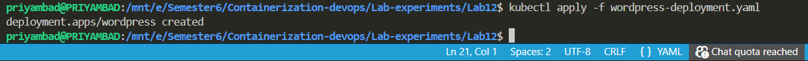
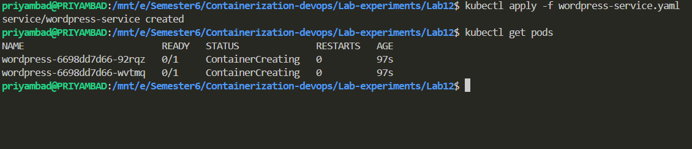
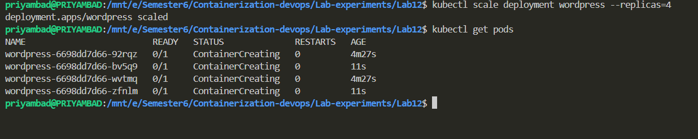
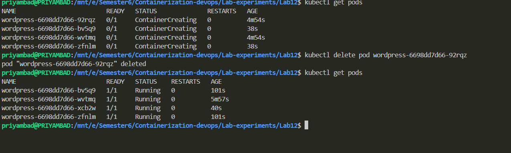

# Kubernetes Lab Experiment – Deploying WordPress using kubeadm

## Overview

This experiment demonstrates the fundamentals of Kubernetes by deploying a real-world application (WordPress) using core Kubernetes objects like Deployments and Services. It also explores scaling and self-healing capabilities of Kubernetes in a cluster created using `kubeadm`.

---

## Objectives

* Understand basic Kubernetes architecture and components
* Set up a Kubernetes cluster using `kubeadm`
* Deploy a WordPress application using a Deployment
* Expose the application using a Service
* Perform scaling operations
* Observe self-healing behavior of Kubernetes

---

## Prerequisites

* Linux environment (Ubuntu / WSL / Virtual Machine)
* Container runtime (Docker / containerd)
* Installed tools:

  * `kubectl`
  * `kubeadm`
  * `kubelet`
* Minimum 2 GB RAM recommended
* Internet connectivity

---

## Cluster Setup using kubeadm

### Step 1: Initialize the Kubernetes Cluster

```bash
sudo kubeadm init
```

---

### Step 2: Configure kubectl for the user

```bash
mkdir -p $HOME/.kube
sudo cp /etc/kubernetes/admin.conf $HOME/.kube/config
sudo chown $(id -u):$(id -g) $HOME/.kube/config
```

---

### Step 3: Install Network Plugin (Calico)

```bash
kubectl apply -f https://docs.projectcalico.org/manifests/calico.yaml
```

---

## Application Deployment (WordPress)

### Step 4: Deploy WordPress

```bash
kubectl apply -f wordpress-deployment.yaml
```

---

### Step 5: Expose WordPress Service

```bash
kubectl apply -f wordpress-service.yaml
```

---

## Verification Commands

### Check Nodes

```bash
kubectl get nodes
```

### Check Pods

```bash
kubectl get pods
```

### Check Services

```bash
kubectl get svc
```

---

## Scaling the Application

Increase the number of replicas:

```bash
kubectl scale deployment wordpress --replicas=3
```

Verify scaling:

```bash
kubectl get pods
```

---

## Self-Healing Test

Delete a running pod:

```bash
kubectl delete pod <pod-name>
```

Kubernetes will automatically recreate the pod to maintain the desired state.

---

## Observations

* Deployments manage pod lifecycle automatically
* Services provide stable network access to applications
* Kubernetes maintains the desired state continuously
* Pods are recreated automatically when they fail (self-healing)
* Scaling can be done dynamically without downtime

---

## Issues Faced During Experiment

* Kubernetes cluster initialization failure using `kubeadm`
* API Server connection refused errors (`connection refused 6443`)
* Problems due to WSL environment limitations
* Container runtime and system configuration issues

---

## Conclusion

In this experiment, we successfully:

* Understood Kubernetes architecture and working
* Deployed a real-world application (WordPress)
* Performed scaling operations
* Tested self-healing capability
* Explored cluster setup using `kubeadm`
## Screenshots 




