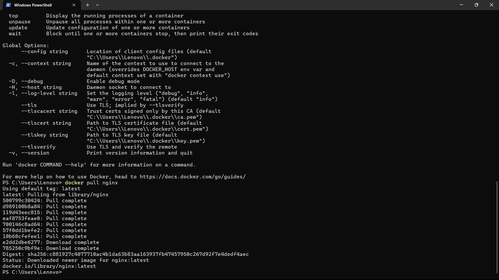
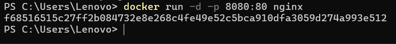
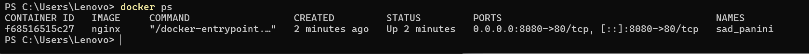
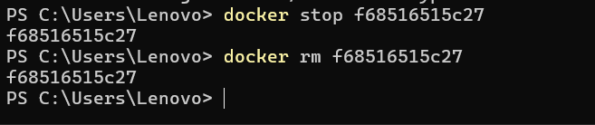
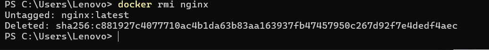

# Experiment 2  
## Docker Installation, Configuration, and Running Images

## Objective
1. Pull Docker images  
2. Run containers  
3. Manage container lifecycle  

## Step 1: Pull Docker Image
Command used:  
docker pull nginx 
 

## Step 2: Run Container with Port Mapping
Command used:  
docker run -d -p 8080:80 nginx  

This command runs the NGINX container in detached mode and maps port 8080 of the host machine to port 80 of the container.

## Step 3: Verify Running Containers
Command used:  
docker ps  

This command displays all currently running containers.

## Step 4: Stop and Remove Container
Commands used:  
docker stop <container_id>  
docker rm <container_id>  

These commands stop the running container and remove it from the system.

## Step 5: Remove Docker Image
Command used:  
docker rmi nginx  

This command removes the NGINX image from the local Docker repository.

## Conclusion
In this experiment, Docker was successfully used to pull images, run containers, and manage their lifecycle.  
The NGINX image was downloaded and executed with proper port mapping to allow access through the host system.  
Running containers were verified using Docker commands.  
Containers were safely stopped and removed after use.  
Finally, the Docker image was deleted to free system resources.  
This experiment demonstrates the basic working of Docker and its importance in container-based application deployment.
