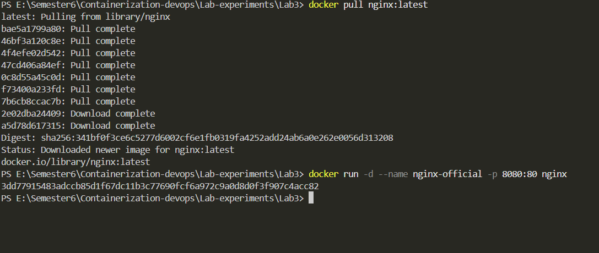
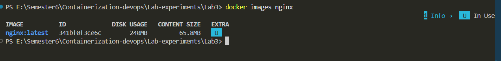
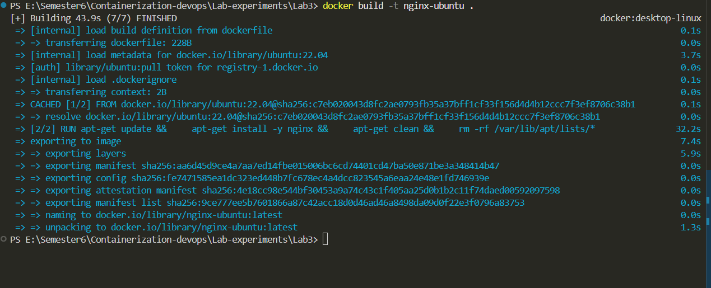
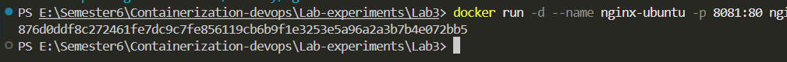
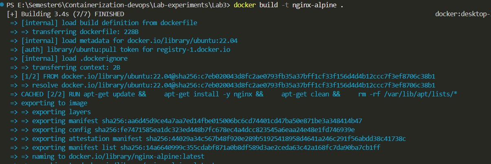
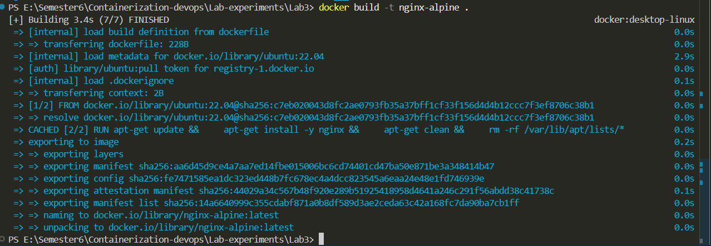
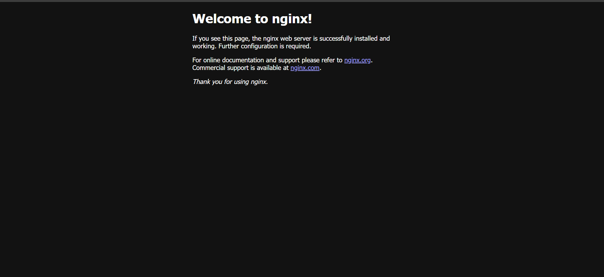
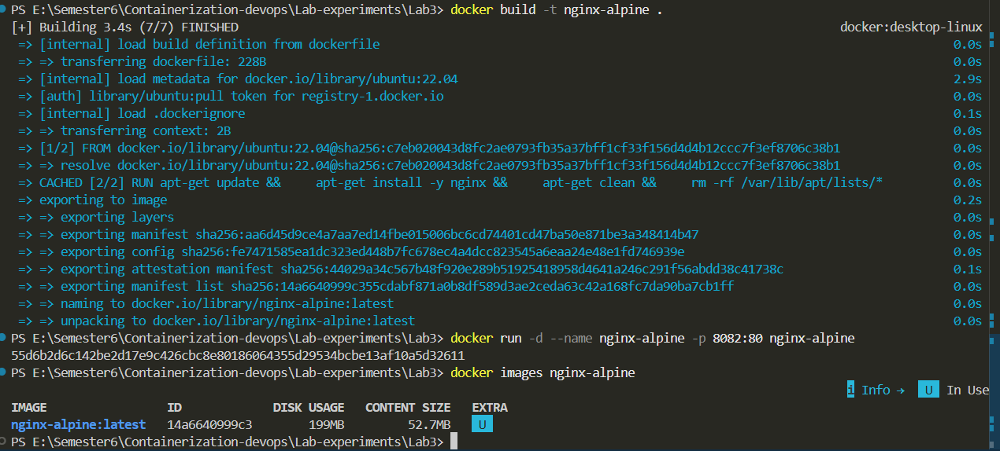
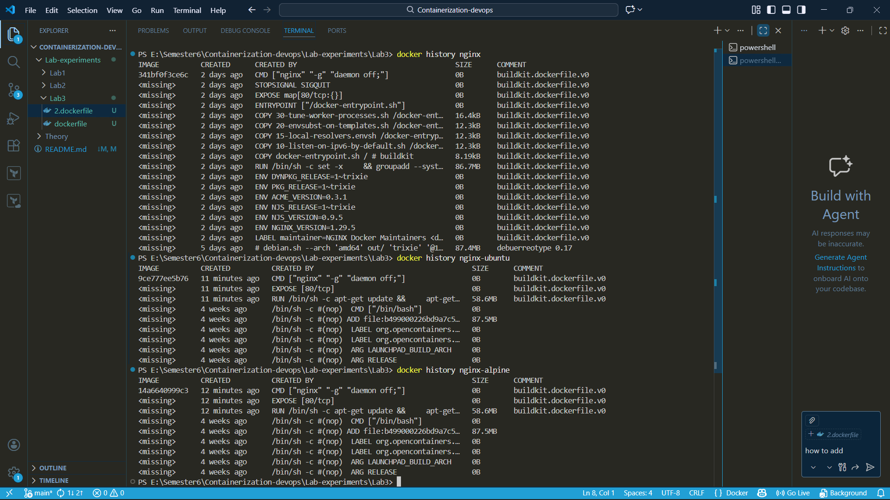
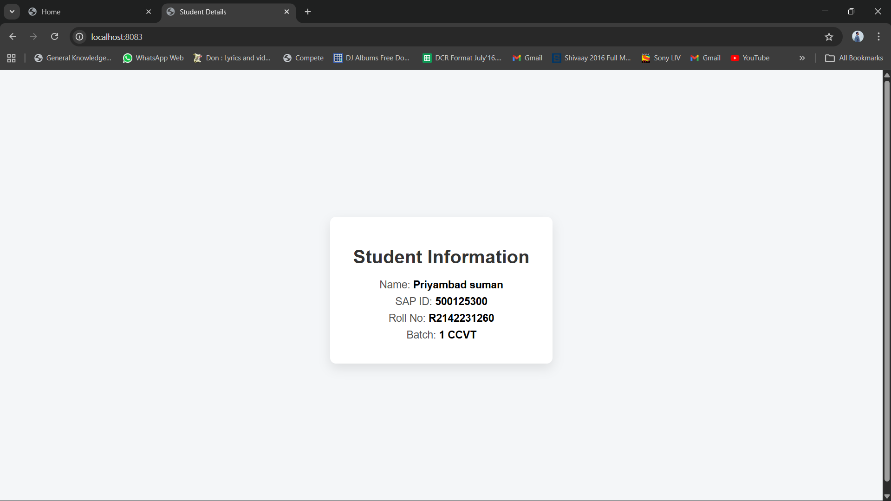

# Experiment 3

## Deployment of NGINX Using Official, Ubuntu-Based and Alpine-Based Docker Images

## Part 1 using Nginx.

## Objective

1. To deploy NGINX using the official Docker image.
2. To create and deploy a custom Ubuntu-based NGINX Docker image.
3. To create and deploy a custom Alpine-based NGINX Docker image.
4. To understand Docker image layering and base image differences.
5. To compare image size, performance, and efficiency.

---

## Steps / Procedure

### Step 1: Pull Official NGINX Image
Download the official NGINX image from Docker Hub using:

`docker pull nginx`

---

### Step 2: Run Official NGINX Container

---

### Step 3: build nginx-ubuntu

---

### Step 4: Mapping ports.

---

### Step 5: Create Ubuntu-Based Dockerfile
Create a Dockerfile using Ubuntu as base image and install NGINX.

---

### Step 6: Build Ubuntu-Based Image
Build the custom image using:

`docker build -t nginx-ubuntu .`

---

### Step 7: Run Ubuntu-Based Container
Run the Ubuntu-based NGINX container.

`docker run -d -p 8081:80 --name nginx-ubuntu-container nginx-ubuntu`

---

### Step 8: Access Ubuntu-Based NGINX
Open browser and access:

`http://localhost:8081`

---

### Step 9: Starting nginx server

---

### Step 10: Build Alpine-Based Image
Build the image using:

`docker build -t nginx-alpine .`

---

### Step 11: Run Alpine-Based Container
Run the Alpine-based container.

---

### Step 12:
Open browser and access:

`http://localhost:8082`

---

### Step 13: Analyze Performance and Differences
Observe startup time, storage size, and efficiency of each image.

---

## Part - 2
[part2](https://divkiller1.github.io/Containerization_and_DevOpsLab/LAB-3/Lab3.html)

## Result

NGINX web server was successfully deployed using:

- Official Docker image  
- Ubuntu-based custom image  
- Alpine-based custom image  

The experiment demonstrated that Alpine-based images are smaller and more lightweight, while Ubuntu-based images offer greater flexibility with increased size. The official NGINX image provides an optimized and production-ready solution.

---

## Conclusion

This experiment highlights the importance of selecting an appropriate base image in Docker. Alpine images offer reduced size and improved efficiency, Ubuntu provides flexibility, and the official NGINX image ensures stability and production readiness. Understanding these differences helps in optimizing containerized application deployments.

---
