# 🐳 Dockerfile, .dockerignore, Tagging & Publishing – Complete Guide

---

# 📌 1️⃣ Flask Application with Docker

## Project Structure

```
my-flask-app/
│── app.py
│── requirements.txt
│── Dockerfile
│── Dockerfile.multistage
│── .dockerignore
```

---

## app.py

```python
from flask import Flask
app = Flask(__name__)

@app.route('/')
def hello():
    return "Hello from Docker!"

@app.route('/health')
def health():
    return "OK"

if __name__ == '__main__':
    app.run(host='0.0.0.0', port=5000)
```

---

## requirements.txt

```
Flask==2.3.3
```

---

## Dockerfile

```dockerfile
FROM python:3.9-slim

WORKDIR /app

COPY requirements.txt .
RUN pip install --no-cache-dir -r requirements.txt

COPY app.py .

EXPOSE 5000

CMD ["python", "app.py"]
```

---

## .dockerignore

```
__pycache__/
*.pyc
.env
.venv
.vscode/
.idea/
.git/
*.log
tests/
```

---

# 📌 Build & Run Commands

```bash
docker build -t my-flask-app .
docker images
docker run -d -p 5000:5000 --name flask-container my-flask-app
docker ps
docker logs flask-container
curl http://localhost:5000
```

---

# 📌 Tagging Images

```bash
docker build -t my-flask-app:1.0 .
docker build -t my-flask-app:latest -t my-flask-app:1.0 .
docker tag my-flask-app:latest my-flask-app:v1.0
docker tag my-flask-app:latest username/my-flask-app:1.0
```

---

# 📌 Image Inspection

```bash
docker history my-flask-app
docker inspect my-flask-app
```

---

# 📌 Multi-Stage Dockerfile (Optimized)

## Dockerfile.multistage

```dockerfile
# STAGE 1
FROM python:3.9-slim AS builder

WORKDIR /app
COPY requirements.txt .
RUN python -m venv /opt/venv
ENV PATH="/opt/venv/bin:$PATH"
RUN pip install --no-cache-dir -r requirements.txt

# STAGE 2
FROM python:3.9-slim

WORKDIR /app
COPY --from=builder /opt/venv /opt/venv
ENV PATH="/opt/venv/bin:$PATH"

COPY app.py .

RUN useradd -m -u 1000 appuser
USER appuser

EXPOSE 5000
CMD ["python", "app.py"]
```

---

## Build Multi-Stage Image

```bash
docker build -f Dockerfile.multistage -t flask-multistage .
docker images | grep flask
```

Expected:
- flask-regular ~250MB
- flask-multistage ~150MB

---

# 📌 Publish to Docker Hub

```bash
docker login
docker tag my-flask-app:latest username/my-flask-app:latest
docker push username/my-flask-app:latest
docker pull username/my-flask-app:latest
docker run -d -p 5000:5000 username/my-flask-app:latest
```

---

# 📌 Node.js Application with Docker

## Project Structure

```
my-node-app/
│── app.js
│── package.json
│── Dockerfile
```

---

## app.js

```javascript
const express = require('express');
const app = express();
const port = 3000;

app.get('/', (req, res) => {
    res.send('Hello from Node.js Docker!');
});

app.get('/health', (req, res) => {
    res.json({ status: 'healthy' });
});

app.listen(port, () => {
    console.log(`Server running on port ${port}`);
});
```

---

## package.json

```json
{
  "name": "node-docker-app",
  "version": "1.0.0",
  "main": "app.js",
  "dependencies": {
    "express": "^4.18.2"
  }
}
```

---

## Node Dockerfile

```dockerfile
FROM node:18-alpine

WORKDIR /app

COPY package*.json ./
RUN npm install --only=production

COPY app.js .

EXPOSE 3000

CMD ["node", "app.js"]
```

---

## Build & Run Node App

```bash
docker build -t my-node-app .
docker run -d -p 3000:3000 --name node-container my-node-app
curl http://localhost:3000
```

---

# 📌 Multiple Tag Example

```bash
docker build -t myapp:latest -t myapp:v2.0 -t username/myapp:production .
```

---

# 📌 Useful Docker Commands Summary

```bash
docker build -t myapp .
docker run -p 3000:3000 myapp
docker ps
docker ps -a
docker images
docker tag myapp:latest myapp:v1
docker push username/myapp
docker pull username/myapp
docker rm container-name
docker rmi image-name
docker exec -it container-name bash
docker container prune
docker image prune
docker system prune -a
```

---

# 📸 Screenshots

## 1. Project Structure
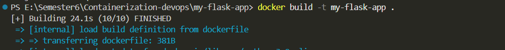

## 2. Docker Build Output
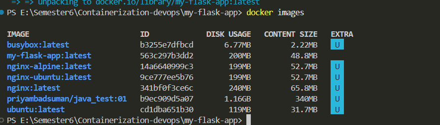

## 3. Docker Images
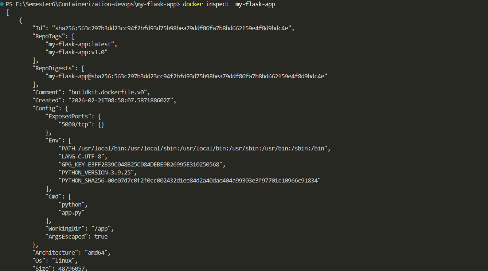

## 4. Running Container
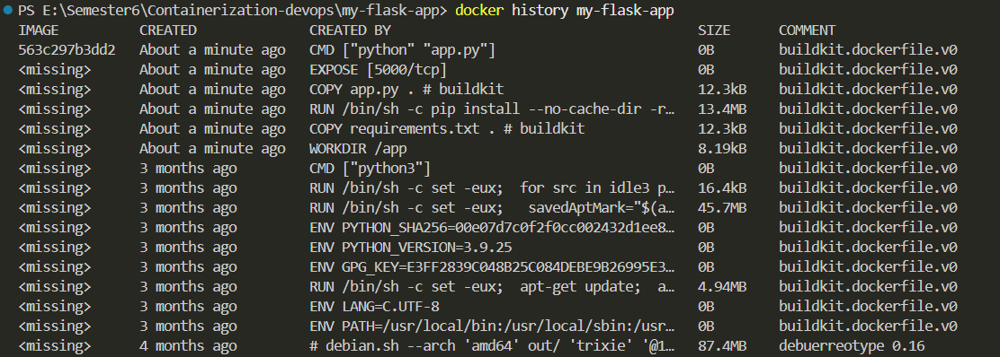

## 5. Curl Output
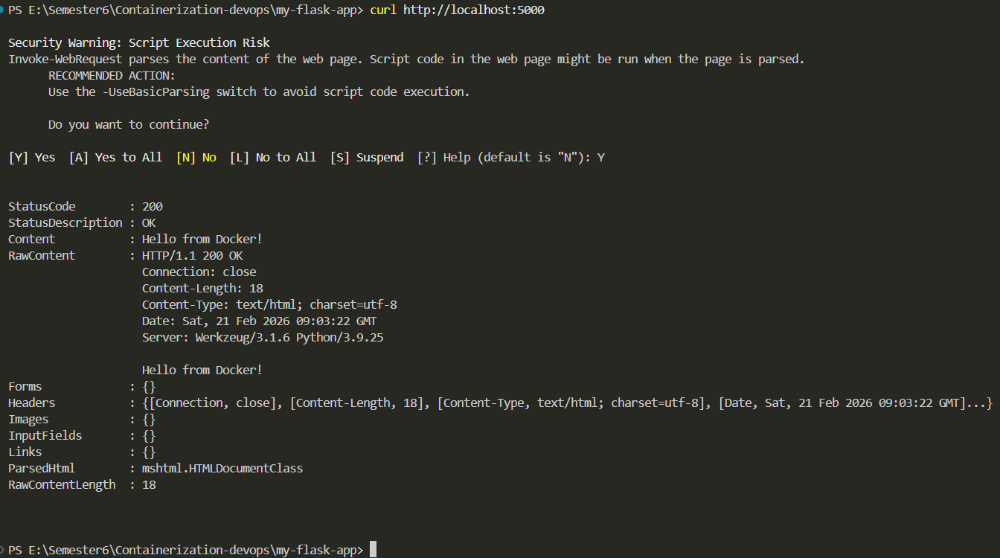

## 6. Docker Logs
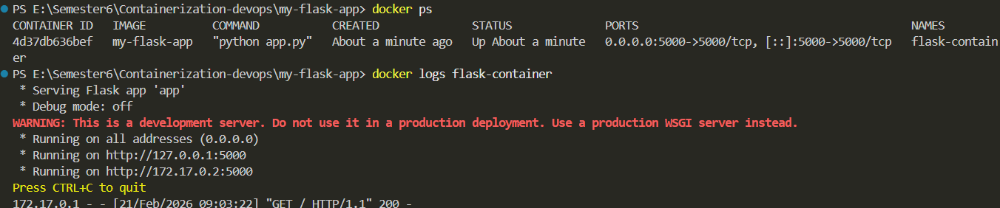

## 7. Multi-Stage Build
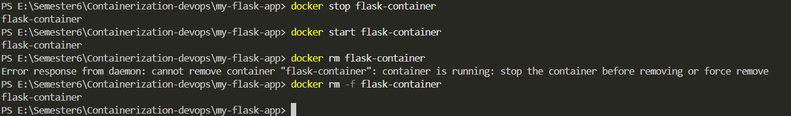

## 8. Image Size Comparison
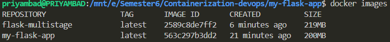

## 9. Docker Login
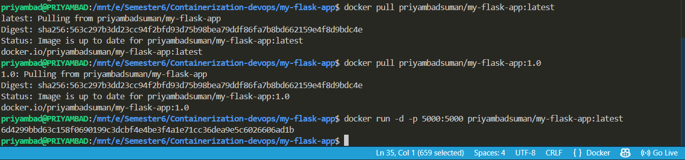

## 10. Docker Push
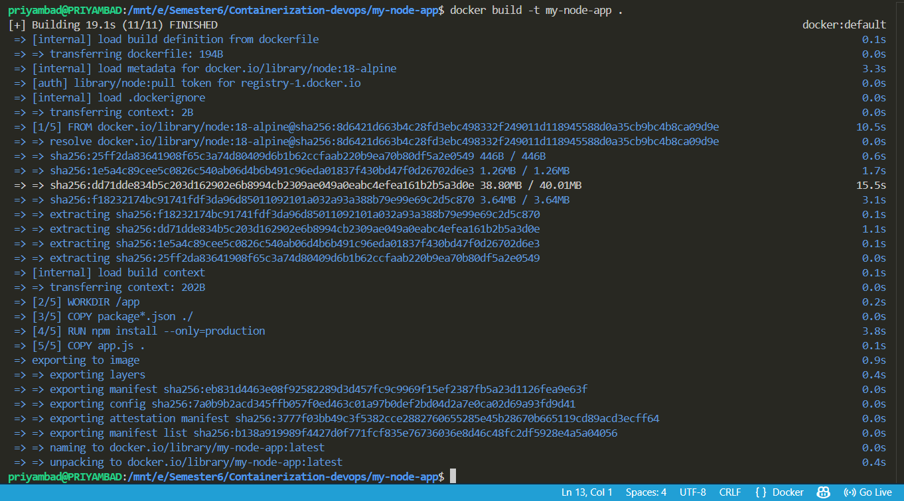

## 11. Docker Pull
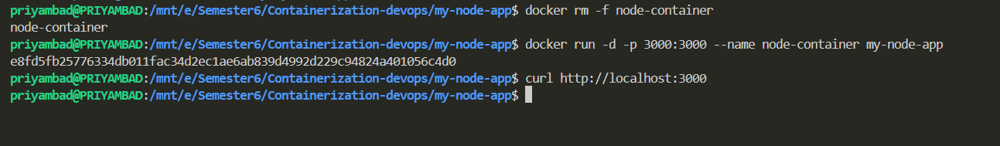

## 12. Node App Running
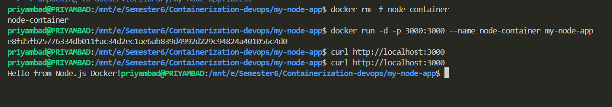

## 13. Docker Tagging
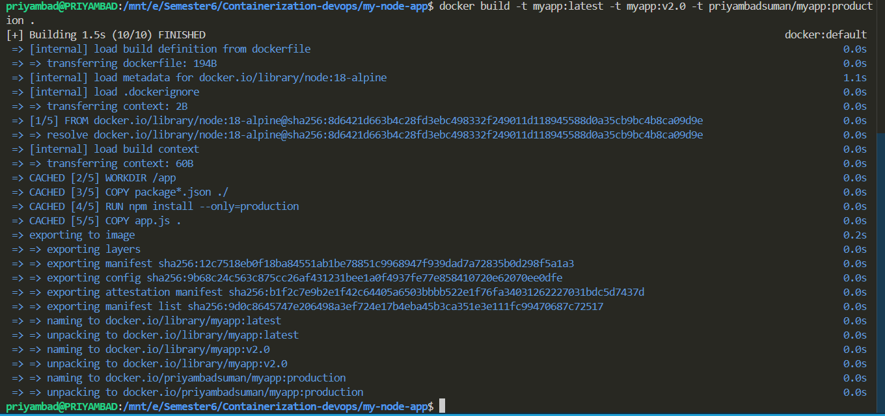

## 14. Docker Prune
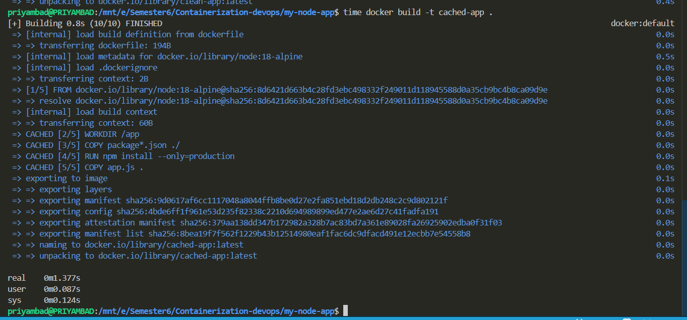

---

# ✅ Conclusion

This project demonstrates:

- Creating Docker images
- Using .dockerignore
- Multi-stage builds
- Image tagging strategies
- Publishing to Docker Hub
- Running Flask & Node apps in containers
- Image optimization techniques
- Docker cleanup operations

---
