# Lab 5: Docker Environment Variables and Flask Configuration Management

## Objective
To understand and demonstrate how Docker handles environment variables, configuration management, and their integration with a Python Flask application running inside a containerized environment.

## Technologies Used
- **Docker**: Container platform
- **Python 3.9**: Programming language
- **Flask**: Web framework
- **Environment Variables**: Configuration management

---

## Experiment Steps

### Step 1: Understanding the Dockerfile Structure

**Description**: Review the Dockerfile that sets up the Python environment and Flask application with environment variable configuration.

**Dockerfile Content**:
```dockerfile
FROM python:3.9-slim

# Set environment variables at build time
ENV PYTHONUNBUFFERED=1
ENV PYTHONDONTWRITEBYTECODE=1

WORKDIR /app

COPY requirements.txt .
RUN pip install -r requirements.txt

COPY app.py .

# Default runtime environment variables
ENV PORT=5000
ENV DEBUG=false

EXPOSE 5000

CMD ["python", "app.py"]
```

**Key Points**:
- Base image: Python 3.9-slim (lightweight)
- Environment variables set for Python optimization
- Working directory set to /app
- Default PORT and DEBUG variables configured

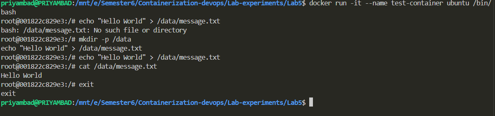

---

### Step 2: Flask Application Code Review

**Description**: Examine the Flask application that reads environment variables and exposes configuration via API.

**Application Code** (app.py):
```python
import os
from flask import Flask

app = Flask(__name__)

# Read environment variables
db_host = os.environ.get('DATABASE_HOST', 'localhost')
debug_mode = os.environ.get('DEBUG', 'false').lower() == 'true'
api_key = os.environ.get('API_KEY')

@app.route('/config')
def config():
    return {
        'db_host': db_host,
        'debug': debug_mode,
        'has_api_key': bool(api_key)
    }

if __name__ == '__main__':
    port = int(os.environ.get('PORT', 5000))
    app.run(host='0.0.0.0', port=port, debug=debug_mode)
```

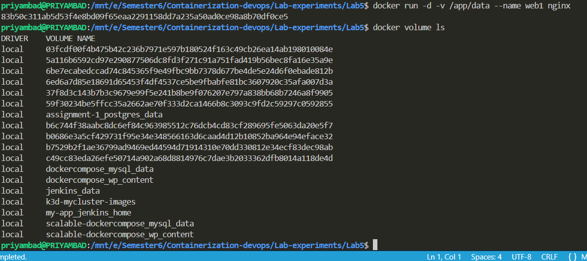

---

### Step 3: Environment Configuration File

**Description**: Review the .env file containing default environment variables.

**.env File Content**:
```
DATABASE_HOST=localhost
DATABASE_PORT=5432
API_KEY=secret123
```

**Purpose**: Centralized configuration management for different deployment environments.

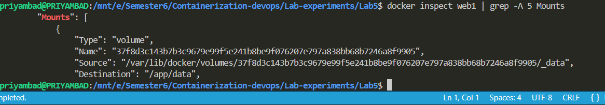

---

### Step 4: Building the Docker Image

**Description**: Build the Docker image from the Dockerfile.

**Command**:
```bash
docker build -t flask-app:latest .
```

**Explanation**:
- `-t` flag tags the image with name:version
- `.` specifies build context (current directory)
- Pulls base image, installs dependencies, copies application files

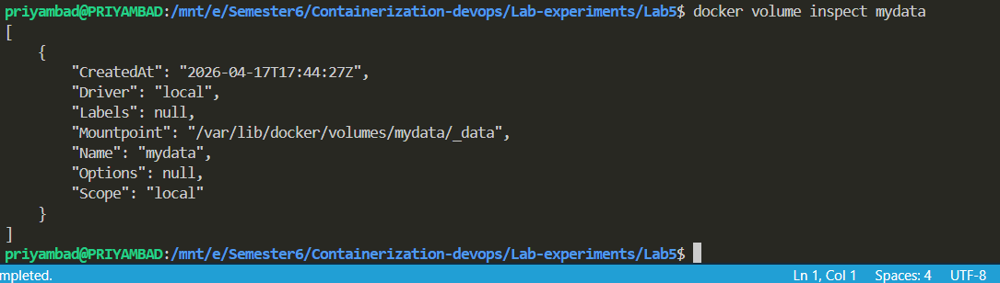

---

### Step 5: Running Container with Default Environment

**Description**: Execute the container with default environment variables defined in Dockerfile.

**Command**:
```bash
docker run -d -p 5000:5000 --name flask-default flask-app:latest
```

**Parameters**:
- `-d`: Detached mode
- `-p 5000:5000`: Port mapping (host:container)
- `--name`: Container identifier
- Default PORT=5000 and DEBUG=false from Dockerfile

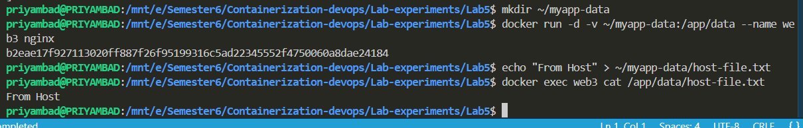

---

### Step 6: Testing Default Configuration Endpoint

**Description**: Query the Flask application configuration endpoint with default settings.

**Command**:
```bash
curl http://localhost:5000/config
```

**Expected Output**:
```json
{
  "db_host": "localhost",
  "debug": false,
  "has_api_key": false
}
```

**Observation**: Uses default values; API_KEY environment variable not set.

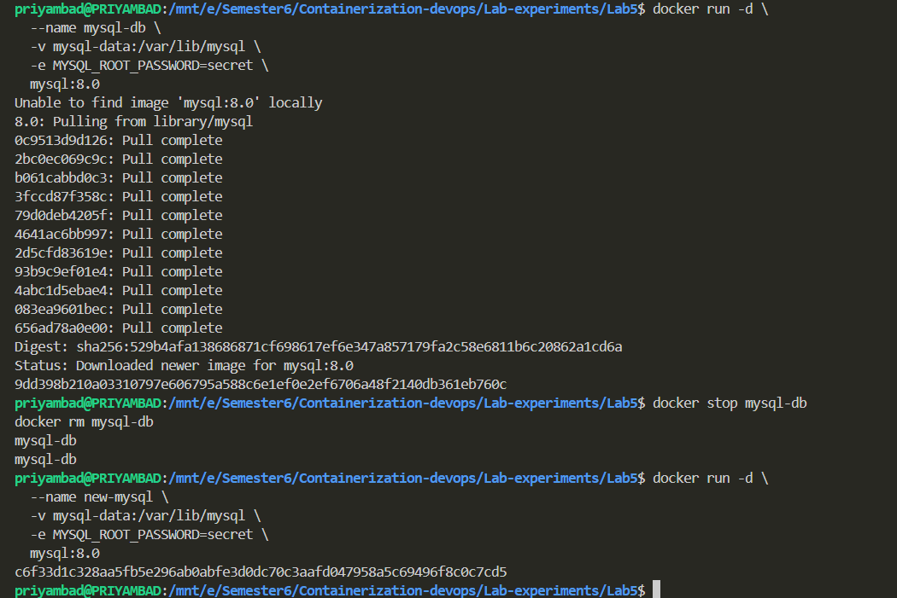

---

### Step 7: Running Container with Custom Environment Variables

**Description**: Run container with custom environment variables using `-e` flag.

**Command**:
```bash
docker run -d -p 5001:5000 --name flask-custom \
  -e DATABASE_HOST=db.example.com \
  -e API_KEY=custom_secret_xyz \
  -e DEBUG=true \
  flask-app:latest
```

**Parameters Explained**:
- `-e DATABASE_HOST=db.example.com`: Override default database host
- `-e API_KEY=custom_secret_xyz`: Provide API key
- `-e DEBUG=true`: Enable debug mode
- `-p 5001:5000`: Map to different host port

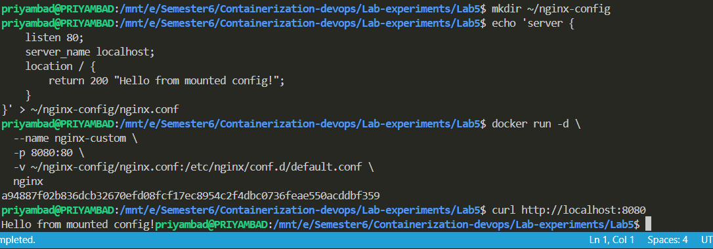

---

### Step 8: Testing Custom Configuration

**Description**: Query the custom container's configuration endpoint.

**Command**:
```bash
curl http://localhost:5001/config
```

**Expected Output**:
```json
{
  "db_host": "db.example.com",
  "debug": true,
  "has_api_key": true
}
```

**Comparison**: Values reflect custom environment variables passed at runtime.

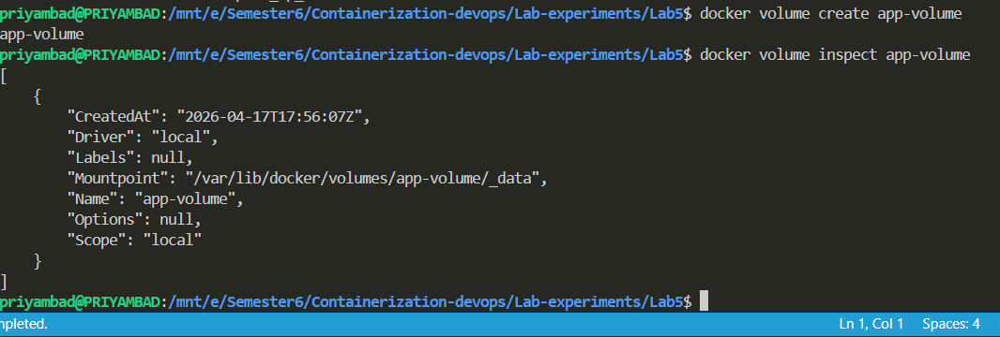

---

### Step 9: Using --env-file for Bulk Environment Variables

**Description**: Load environment variables from .env file instead of individual `-e` flags.

**Command**:
```bash
docker run -d -p 5002:5000 --name flask-envfile \
  --env-file .env \
  flask-app:latest
```

**Advantages**:
- Cleaner command line
- Easier to manage multiple variables
- Supports different env files for different environments

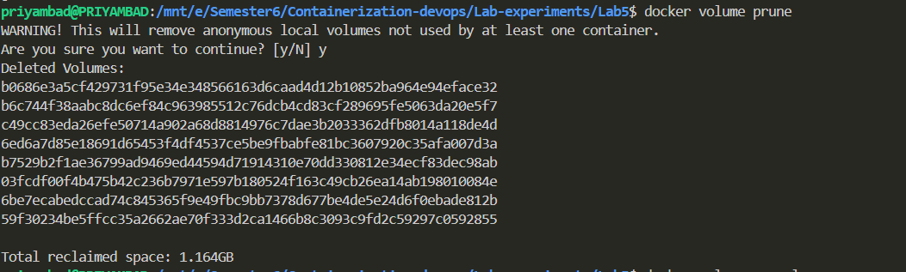

---

### Step 10: Testing env-file Container

**Description**: Verify configuration from .env file.

**Command**:
```bash
curl http://localhost:5002/config
```

**Expected Output**:
```json
{
  "db_host": "localhost",
  "debug": false,
  "has_api_key": true
}
```

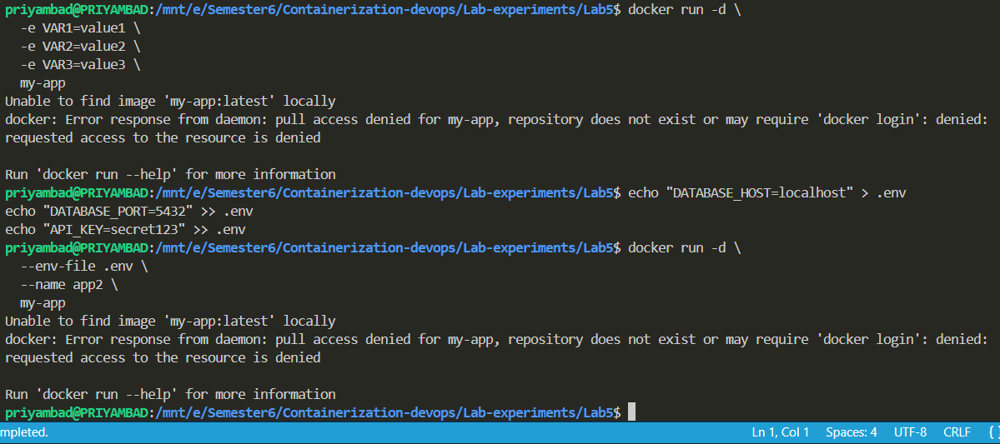

---

### Step 11: Combining env-file with Individual Variables

**Description**: Mix environment file with override variables.

**Command**:
```bash
docker run -d -p 5003:5000 --name flask-mixed \
  --env-file .env \
  -e DEBUG=true \
  flask-app:latest
```

**Result**: env-file values are loaded first, then individual `-e` flags override them.

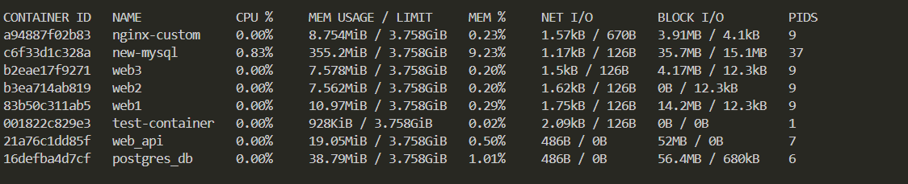

---

### Step 12: Testing Mixed Configuration

**Description**: Verify that individual variables override env-file values.

**Command**:
```bash
curl http://localhost:5003/config
```

**Expected Output**:
```json
{
  "db_host": "localhost",
  "debug": true,
  "has_api_key": true
}
```

**Note**: DEBUG=true overrides the .env value.

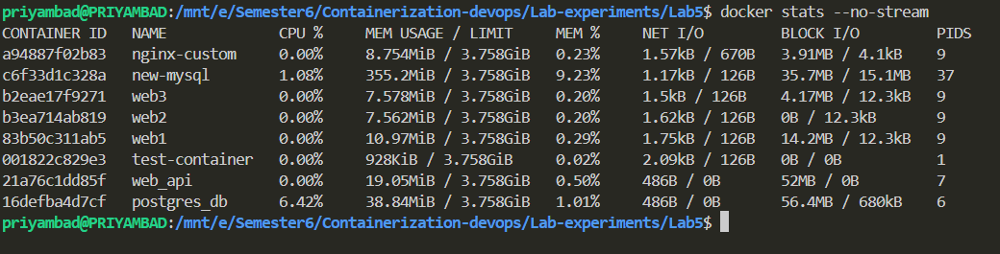

---

### Step 13: Inspecting Container Environment

**Description**: View all environment variables inside a running container.

**Command**:
```bash
docker exec flask-custom env
```

**Output**: Lists all environment variables set in the container.

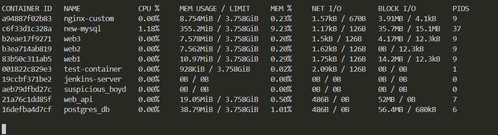

---

### Step 14: Viewing Container Logs

**Description**: Check Flask application logs for startup and configuration info.

**Command**:
```bash
docker logs flask-custom
```

**Expected Output**: Flask startup messages showing host, port, and debug mode.

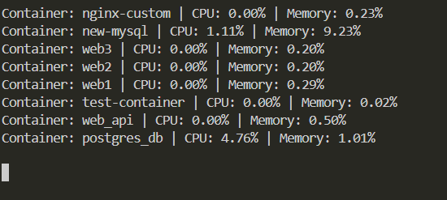

---

### Step 15: Running Port Configuration Tests

**Description**: Test accessing Flask app through different mapped ports to verify isolation.

**Command**:
```bash
curl http://localhost:5000/config
curl http://localhost:5001/config
curl http://localhost:5002/config
curl http://localhost:5003/config
```

**Result**: Each container instance maintains separate configuration and state.

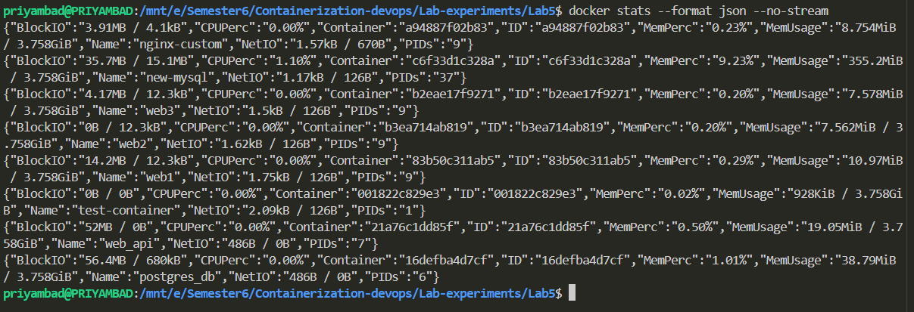

---

### Step 16: Environment Variable Priority

**Description**: Demonstrate the precedence order of environment variables.

**Priority Order** (highest to lowest):
1. Variables passed with `-e` flag at runtime
2. Variables from `--env-file`
3. Variables set with ENV in Dockerfile

**Command**:
```bash
docker run -e PORT=8000 -e DEBUG=true --env-file .env -p 8000:8000 flask-app:latest
```

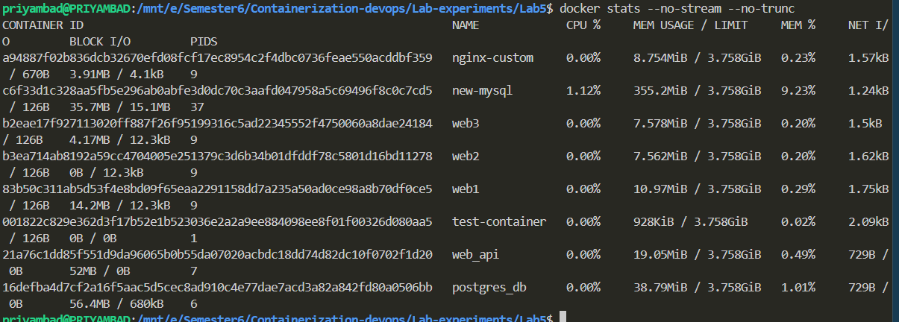

---

### Step 17: Using docker-compose for Multiple Services

**Description**: Create a docker-compose file to simplify multi-container deployments with environment variables.

**Command** (using docker-compose):
```bash
docker-compose up -d
```

**Benefits**:
- Centralized configuration
- Easy service orchestration
- Simplified deployment

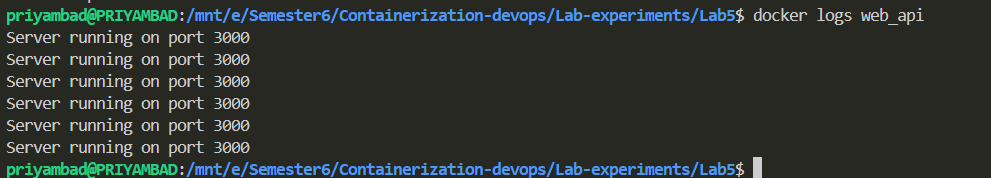

---

### Step 18: Listing All Running Containers

**Description**: View all running containers and their configurations.

**Command**:
```bash
docker ps -a
```

**Output**: Shows all containers with names, ports, and status.

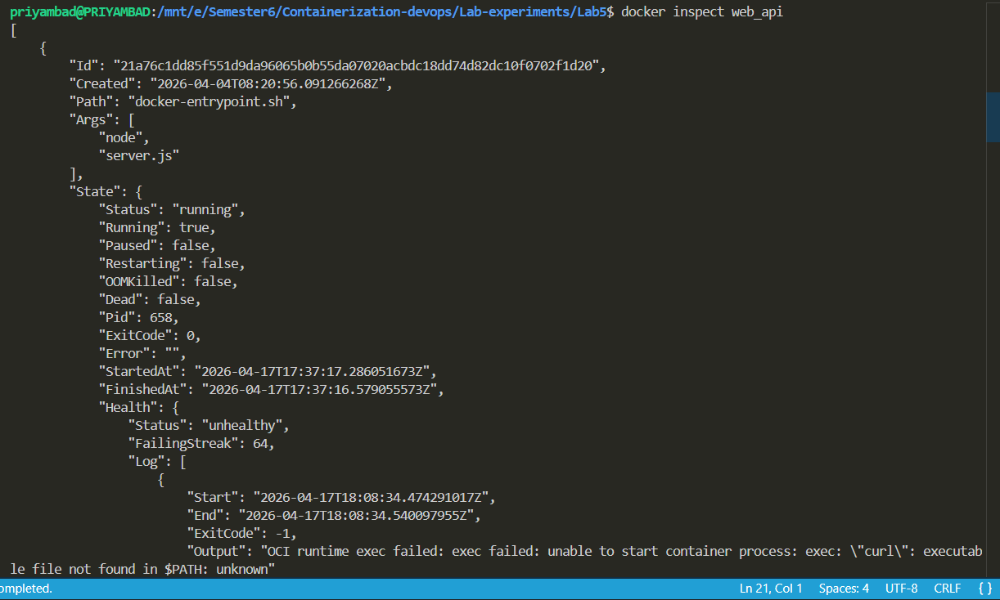

---

### Step 19: Cleaning Up Containers

**Description**: Stop and remove all test containers.

**Command**:
```bash
docker stop flask-default flask-custom flask-envfile flask-mixed
docker rm flask-default flask-custom flask-envfile flask-mixed
```

**Cleanup Complete**: All test containers removed.

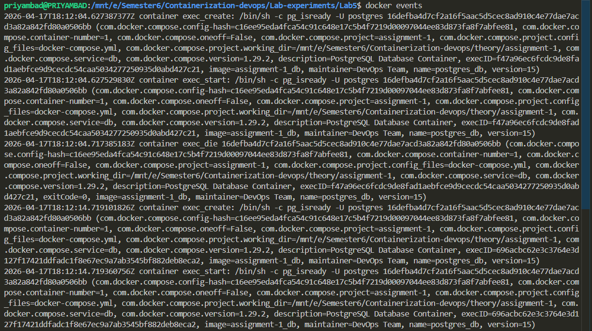

---

### Step 20: Best Practices Review

**Description**: Summary of environment variable best practices in Docker.

**Key Takeaways**:
- ✅ Use environment variables for configuration (not hardcoded values)
- ✅ Provide sensible defaults in Dockerfile
- ✅ Use .env files for development environments
- ✅ Override with `-e` flags for production/special cases
- ✅ Never commit secrets to version control
- ✅ Document all environment variables
- ✅ Use docker-compose for multi-container applications
- ✅ Validate environment variables at application startup

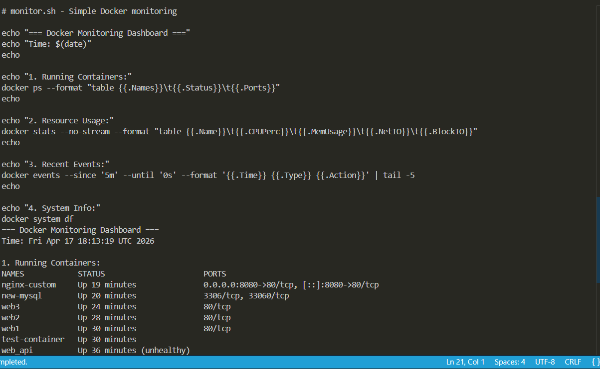

---

## Key Learnings

1. **Environment Variables in Docker**: Essential for configuration management across different environments.
2. **Build-time vs Runtime Variables**: ENV in Dockerfile vs -e flags at runtime serve different purposes.
3. **Configuration Precedence**: Understanding the priority order prevents unexpected behavior.
4. **env-file Usage**: Streamlines deployment with multiple configuration values.
5. **Container Isolation**: Each container instance maintains independent environments.
6. **Flask Integration**: Python applications can easily access Docker environment variables using `os.environ`.

---

## Commands Summary

| Command | Purpose |
|---------|---------|
| `docker build -t name:tag .` | Build Docker image |
| `docker run -e VAR=value image` | Run with environment variable |
| `docker run --env-file .env image` | Run with env file |
| `docker exec container env` | View container environment |
| `docker logs container` | View container logs |
| `docker ps -a` | List all containers |
| `docker stop/rm container` | Stop/remove container |

---

## Troubleshooting

### Issue: Variables not passed to container
**Solution**: Verify `-e` flag syntax and check variable names match application code.

### Issue: Application can't read environment variables
**Solution**: Ensure variables are set before application starts; use `docker exec` to inspect actual environment.

### Issue: env-file not loading
**Solution**: Verify file path is correct and file has proper format (KEY=VALUE, one per line).

---

## Conclusion

This lab demonstrates comprehensive understanding of Docker environment variable management. Environment variables are fundamental to containerized applications, enabling configuration without code changes and supporting deployment across multiple environments (development, staging, production) with the same image. Proper environment variable handling is a critical DevOps practice.
