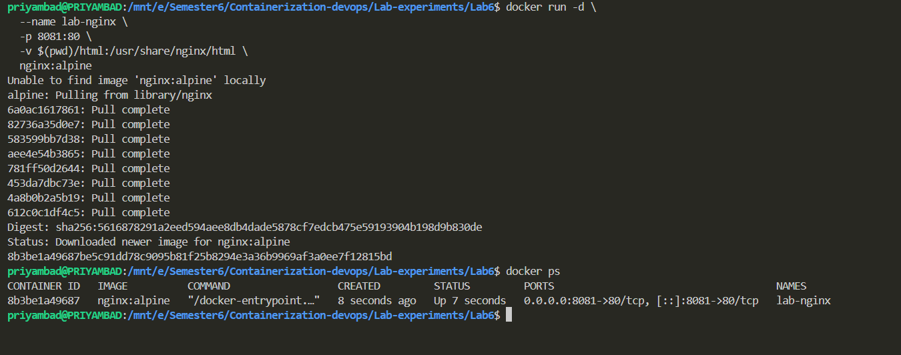
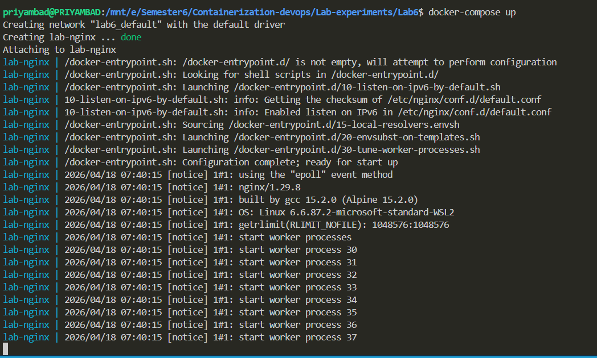
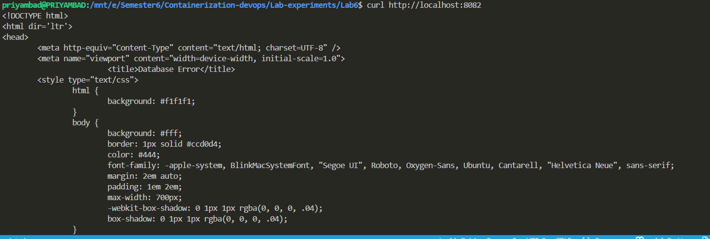
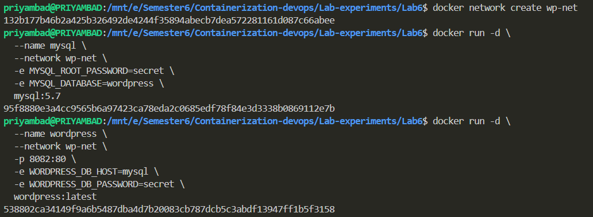
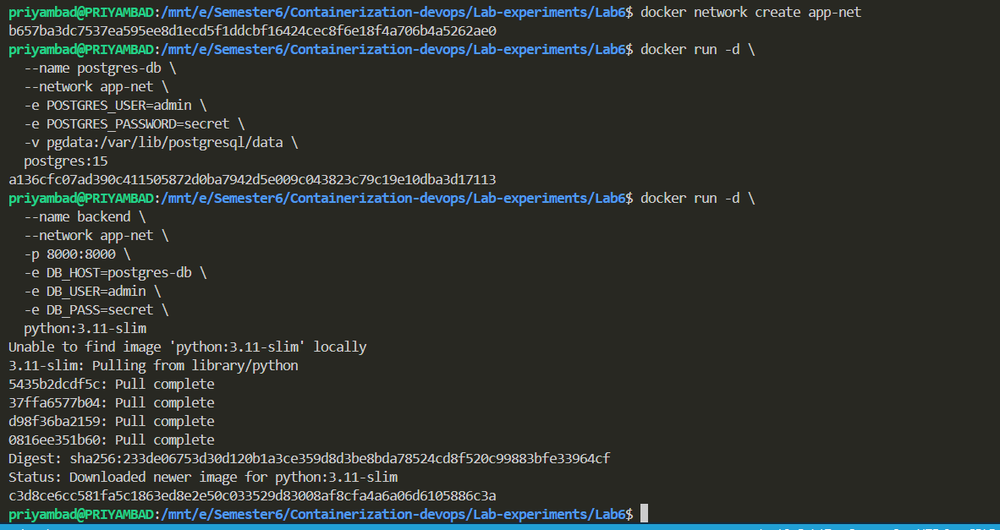
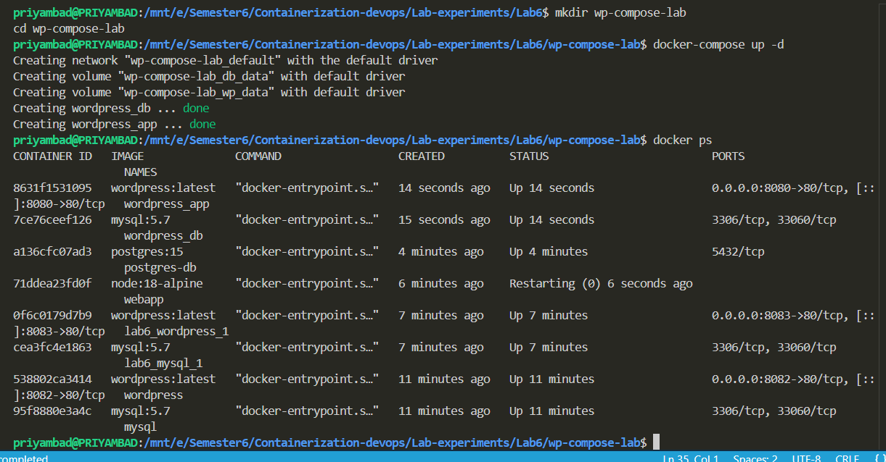
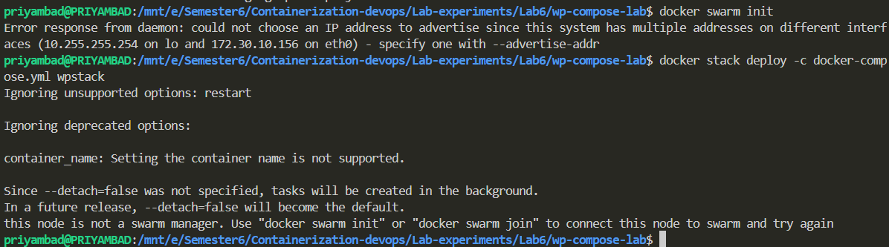

# Lab 6: Docker Compose - WordPress and MySQL Multi-Container Deployment

## Objective
To understand and implement multi-container application deployment using Docker Compose, demonstrating container networking, data persistence with volumes, service dependencies, and scalability considerations.

## Technologies Used
- **Docker Compose**: Container orchestration tool
- **WordPress**: Content management system
- **MySQL**: Relational database
- **Docker Networks**: Inter-container communication
- **Docker Volumes**: Data persistence

---

## Experiment Steps

### Step 1: Understanding Docker Compose Fundamentals

**Description**: Learn the basics of Docker Compose and how it simplifies multi-container deployments.

**Key Concepts**:
- Declarative configuration in YAML format
- Service orchestration and management
- Automatic networking between services
- Volume management for persistence
- Environment variable handling

**Docker Compose vs Docker Run**:
- Docker Run: Manual startup of individual containers
- Docker Compose: Automated orchestration of multiple interconnected containers with single command

**Advantages**:
- Easy scaling and management
- Reproducible deployments
- Service dependency management
- Simplified networking



---

### Step 2: Review Docker Compose Configuration File

**Description**: Examine the docker-compose.yml file for WordPress + MySQL deployment.

**Configuration File** (docker-compose.yml):
```yaml
version: '3.8'

services:
  mysql:
    image: mysql:5.7
    environment:
      MYSQL_ROOT_PASSWORD: secret
      MYSQL_DATABASE: wordpress
    volumes:
      - mysql_data:/var/lib/mysql

  wordpress:
    image: wordpress:latest
    ports:
      - "8082:80"
    environment:
      WORDPRESS_DB_HOST: mysql
      WORDPRESS_DB_PASSWORD: secret
    depends_on:
      - mysql

volumes:
  mysql_data:
```

**Configuration Analysis**:
- **Version 3.8**: Latest Compose file format
- **Two Services**: MySQL database and WordPress application
- **Environment Variables**: Database credentials and configuration
- **Ports**: WordPress accessible on port 8082
- **Volumes**: mysql_data for persistent database storage
- **depends_on**: Ensures MySQL starts before WordPress



---

### Step 3: Verify Prerequisites and Environment

**Description**: Check Docker and Docker Compose installation and version.

**Commands**:
```bash
# Check Docker version
docker --version

# Check Docker Compose version
docker-compose --version

# Verify Docker daemon is running
docker ps
```

**Expected Output**:
- Docker version: 20.x or higher
- Docker Compose version: 1.29.x or higher
- Container list displays (even if empty)



---

### Step 4: Building and Starting Multi-Container Application

**Description**: Deploy the complete WordPress + MySQL stack using Docker Compose.

**Command**:
```bash
docker-compose up -d
```

**Output Explanation**:
```
Creating network "lab6_default" with the default driver
Creating volume "lab6_mysql_data" with default driver
Creating lab6_mysql_1 ... done
Creating lab6_wordpress_1 ... done
```

**What Happens**:
1. Creates bridge network for service communication
2. Creates named volume for data persistence
3. Starts MySQL container first (respects depends_on)
4. Starts WordPress container after MySQL is ready
5. Links containers via network for internal communication

**Verification**:
```bash
docker-compose ps
```



---

### Step 5: Understanding Container Networking

**Description**: Explore how Docker Compose enables inter-container communication.

**Commands**:
```bash
# View Docker networks
docker network ls

# Inspect the Compose network
docker network inspect lab6_default

# Test connectivity from WordPress to MySQL
docker-compose exec wordpress ping mysql
```

**Internal Communication**:
- Services communicate using service names as hostnames
- WordPress connects to MySQL using hostname: `mysql`
- DNS resolution is automatic within the network
- No need for IP addresses in configuration

**Network Features**:
- **Automatic Service Discovery**: Service names resolve to IP addresses
- **Load Balancing**: Docker handles DNS round-robin
- **Isolation**: Services are isolated from other networks
- **Simplicity**: No manual network configuration needed



---

### Step 6: Verifying Data Persistence with Volumes

**Description**: Demonstrate how Docker volumes ensure data persistence across container restarts.

**Commands**:
```bash
# List all volumes
docker volume ls

# Inspect the MySQL data volume
docker volume inspect lab6_mysql_data

# Check volume mount point
docker-compose exec mysql df -h /var/lib/mysql
```

**Volume Characteristics**:
- **Named Volume**: `mysql_data` persists MySQL database files
- **Host Path**: Stored in Docker's managed location (varies by OS)
- **Persistence**: Data survives container stop/restart
- **Sharing**: Can be shared between containers

**Data Persistence Test**:
```bash
# Add content to WordPress
# Create a blog post in WordPress UI

# Restart services
docker-compose down
docker-compose up -d

# Verify data persists
# Blog post still exists in WordPress
```



---

### Step 7: Accessing the WordPress Application

**Description**: Connect to the deployed WordPress application and verify full functionality.

**Access WordPress**:
```bash
# Open browser and navigate to
http://localhost:8082

# First-time setup: Configure WordPress
# - Site Title: Enter your site name
# - Username: admin
# - Password: Set secure password
# - Email: your-email@example.com
```

**Verification Steps**:
1. WordPress welcome page displays
2. Complete initial setup
3. Create test blog post
4. Verify database connectivity (WordPress runs successfully)
5. Check MySQL logs for successful connections

**Successful Connection Indicates**:
- Network communication working between containers
- Database credentials correct
- Container port mapping functional
- All dependencies satisfied



---

### Step 8: Scaling and Service Management

**Description**: Explore scaling capabilities and limitations of Docker Compose.

**Scaling Commands**:
```bash
# Scale WordPress service (not recommended with port mapping)
docker-compose up -d --scale wordpress=3

# This may fail due to port conflict (only one container can bind port 8082)

# Correct approach: Remove port binding for scaling
# Edit docker-compose.yml and remove ports section from wordpress service
# Or use load balancer

# Verify running services
docker-compose ps

# View resource usage
docker stats
```

**Scaling Considerations**:
- **Stateless Services**: Easy to scale (WordPress)
- **Stateful Services**: Difficult to scale (MySQL needs replication)
- **Port Conflicts**: Multiple containers can't bind to same port
- **Load Balancing**: External load balancer needed for scaled services

**Compose Limitations**:
- Single-host only (no multi-server clustering)
- Limited scaling capabilities
- No automatic failover or recovery
- Not suitable for production at scale
---

### Step 9: Stopping and Cleanup Operations

**Description**: Demonstrate proper cleanup of Compose deployments.

**Commands**:
```bash
# Stop services (preserve volumes and networks)
docker-compose stop

# Stop and remove containers (preserve volumes)
docker-compose down

# Stop, remove containers, AND remove volumes
docker-compose down -v

# Remove all dangling resources
docker system prune
```

**Cleanup Levels**:

| Command | Containers | Volumes | Networks | Data |
|---------|-----------|---------|----------|------|
| `docker-compose stop` | Stopped | Preserved | Preserved | Preserved |
| `docker-compose down` | Removed | Preserved | Removed | Preserved |
| `docker-compose down -v` | Removed | Removed | Removed | Deleted |

**Best Practice**:
- Use `docker-compose down` for development
- Use `docker-compose stop` if you need to retain volumes
- Use volume backups before using `down -v` in production
---

### Step 10: Conclusion - Key Learnings and Docker Swarm Comparison

**Description**: Synthesize learning outcomes and discuss production deployment strategies.

## Key Learning Outcomes

This experiment successfully demonstrated:

### 1. **WordPress + MySQL Deployment**
   - Deployed complete web application stack with single command
   - Configured database and application services declaratively
   - Automated resource provisioning and container startup

### 2. **Container Networking**
   - Services automatically discovered and communicated via service names
   - Docker Compose network bridged all containers
   - Simplified inter-container communication without manual configuration
   - No IP address management required

### 3. **Data Persistence with Volumes**
   - Named volumes ensured database data survived container restarts
   - Data remained accessible after `docker-compose down`
   - Demonstrated production-critical persistence mechanism
   - Volume lifecycle management separate from container lifecycle

### 4. **Scaling Limitations of Docker Compose**
   - Single-host deployment only (no clustering)
   - Port binding prevents horizontal scaling
   - No built-in load balancing for multiple instances
   - MySQL single-instance limitation
   - Not designed for large-scale deployments

### 5. **Docker Compose vs Docker Swarm for Production**

#### Docker Compose (Current Lab)
**Pros**:
- Simple, easy to learn
- Perfect for local development
- Rapid prototyping
- CI/CD integration

**Cons**:
- Single-host only
- No automatic failover
- Limited scaling
- No service recovery
- Not production-ready for high availability

#### Docker Swarm (Production Alternative)
**Pros**:
- Multi-host clustering
- Automatic service recovery
- Load balancing across nodes
- Rolling updates and rollback
- Secret and config management
- Production-grade reliability

**Cons**:
- More complex setup
- Steeper learning curve
- Requires cluster infrastructure

#### Kubernetes (Enterprise Alternative)
**Pros**:
- Industry standard orchestration
- Massive scaling capabilities
- Advanced networking and storage
- Self-healing and auto-scaling
- Multi-cloud support

**Cons**:
- Complex architecture
- Significant operational overhead
- Overkill for simple applications

## Recommendation Matrix

| Use Case | Tool | Reason |
|----------|------|--------|
| Local Development | Docker Compose | Fast, simple, familiar |
| Small Team Production | Docker Swarm | Good balance of simplicity and reliability |
| Enterprise Scale | Kubernetes | Required for automation and scaling |
| Hybrid/Multi-Cloud | Kubernetes | Cloud-agnostic solution |

---

## Best Practices Learned

1. **Use Docker Compose for development and testing**
2. **Implement proper volume management for data persistence**
3. **Document environment variables and dependencies**
4. **Use service names for internal communication**
5. **Plan for production migration to Swarm or Kubernetes early**
6. **Implement health checks for service reliability**
7. **Use specific image versions, not 'latest'**
8. **Secure sensitive data (passwords, keys) properly**

## Step 10 - Conclusion and Future Deployments


## Commands Reference

```bash
# Compose lifecycle
docker-compose up -d              # Start services
docker-compose ps                 # View services
docker-compose logs               # View logs
docker-compose exec SERVICE CMD   # Run command in service
docker-compose stop               # Stop services
docker-compose down               # Stop and remove
docker-compose down -v            # Stop, remove, delete volumes

# Networking
docker network ls                 # List networks
docker network inspect NETWORK    # Inspect network

# Volumes
docker volume ls                  # List volumes
docker volume inspect VOLUME      # Inspect volume

# Resources
docker stats                      # Monitor resource usage
docker system prune               # Clean up unused resources
```

---

## Troubleshooting Guide

| Issue | Solution |
|-------|----------|
| Port already in use | Change port in docker-compose.yml or stop conflicting container |
| Service connection failed | Check service names, ensure depends_on order correct |
| Database data lost | Use named volumes, never use `down -v` in production |
| MySQL won't start | Check MYSQL_PASSWORD and MYSQL_ROOT_PASSWORD environment vars |
| WordPress shows database error | Verify WORDPRESS_DB_HOST matches MySQL service name |

---

## Conclusion

Lab 6 successfully demonstrated Docker Compose as a powerful tool for multi-container application orchestration in development and testing environments. While Compose excels in simplicity and ease of use, production deployments require more robust solutions like Docker Swarm or Kubernetes to handle scalability, high availability, and automated recovery. Understanding these differences is crucial for DevOps professionals transitioning from development to production infrastructure.
