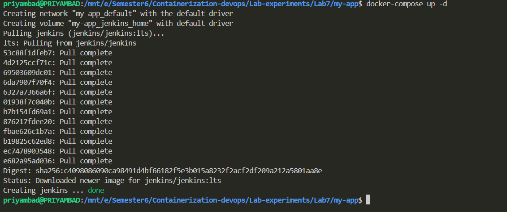
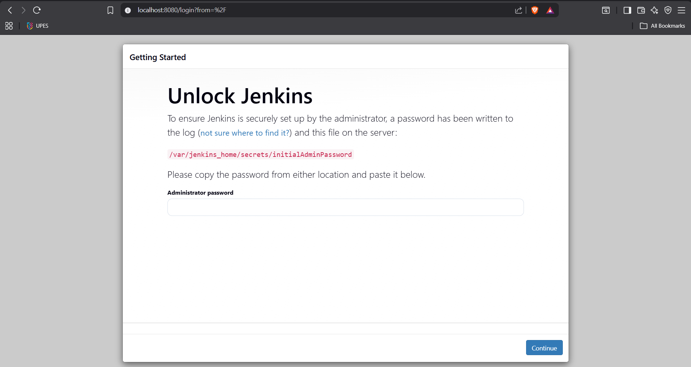
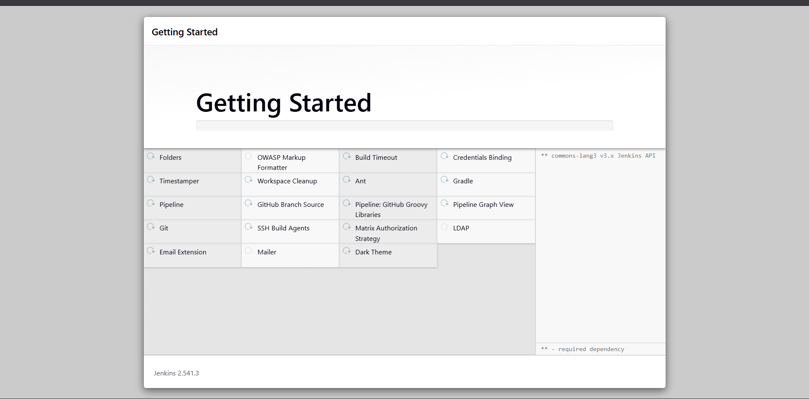
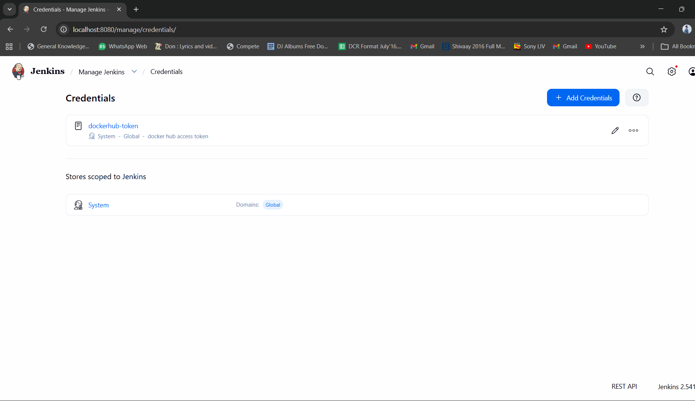
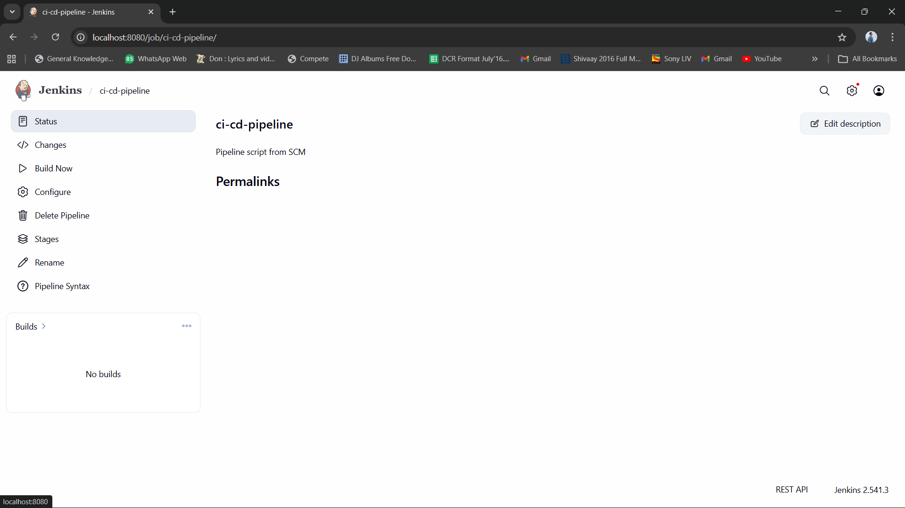
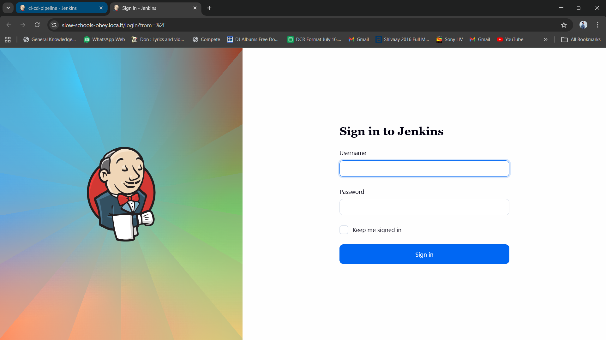
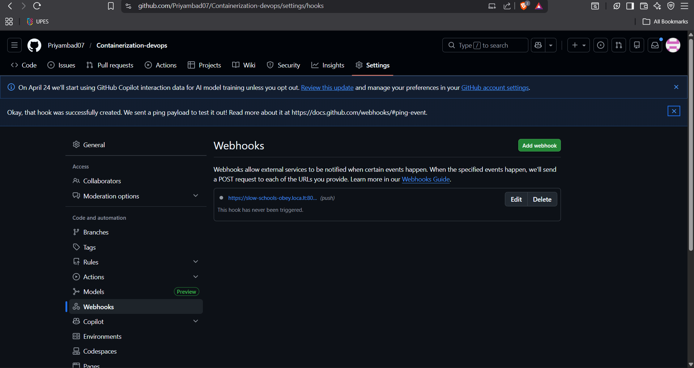

# Lab 7: CI/CD Pipeline with Jenkins, GitHub, and Docker

**Student:** Priyambad Suman | **Lab:** 7

## Objective

Build a complete CI/CD pipeline that automatically builds Docker images from GitHub code and pushes them to Docker Hub whenever code is committed.

---

## Architecture

```
GitHub Repository
       ↓ (webhook on push)
  Jenkins Server
       ↓ (checkout & build)
Build Docker Image
       ↓ (push)
Docker Hub Registry
```

---

## Process Done

### Step 1: Jenkins Setup

Installed Jenkins using Docker with Docker socket access:

```bash
docker run -d --name jenkins -p 8080:8080 -p 50000:50000 \
  -v /var/run/docker.sock:/var/run/docker.sock \
  -v /usr/bin/docker:/usr/bin/docker \
  jenkins/jenkins:lts
```

 Jenkins running at `http://localhost:8080`

---

### Step 2: Installed Jenkins Plugins

Required plugins installed:
- GitHub Plugin (webhook triggers)
- Docker Pipeline (build Docker images)
- Credentials Binding Plugin (secure credentials)
- Pipeline Plugin (declarative pipelines)

 All plugins active

---

### Step 3: Added Docker Hub Credentials

Stored credentials securely in Jenkins:
- **Manage Jenkins** → **Manage Credentials** → **Global credentials**
- Created credential with ID: `docker-hub-creds`
- Used Personal Access Token (not password for security)

 Credentials stored

---

### Step 4: Created GitHub Repository

Repository structure:
```
my-app/
├── Dockerfile (multi-stage build)
├── Jenkinsfile (pipeline configuration)
├── src/ (application code)
└── package.json (dependencies)
```

 Repository ready

---

### Step 5: Created Pipeline Job

Configured Jenkins pipeline:
- Job name: `my-app-pipeline`
- Type: Pipeline (Declarative)
- SCM: Git
- Script path: `Jenkinsfile`

 Job created and configured

---

### Step 6: Configured GitHub Webhook

Set up automatic trigger:
- Webhook URL: `http://YOUR_JENKINS_IP:8080/github-webhook/`
- Content type: JSON
- Events: Push and Pull Request

 Webhook verified (green checkmark)

---

## Jenkinsfile Pipeline

```groovy
pipeline {
    agent docker
    
    stages {
        stage('Checkout') {
            steps { checkout scm }
        }
        
        stage('Build & Test') {
            steps { sh 'npm install && npm test' }
        }
        
        stage('Build Docker Image') {
            steps { sh 'docker build -t myapp:${BUILD_NUMBER} .' }
        }
        
        stage('Push to Docker Hub') {
            steps {
                withCredentials([usernamePassword(credentialsId: 'docker-hub-creds', usernameVariable: 'USER', passwordVariable: 'PASS')]) {
                    sh '''
                        echo $PASS | docker login -u $USER --password-stdin
                        docker tag myapp:${BUILD_NUMBER} $USER/myapp:latest
                        docker push $USER/myapp:latest
                    '''
                }
            }
        }
    }
}
```

---

## How It Works

When code is pushed to GitHub:

1. **GitHub webhook** sends notification to Jenkins
2. **Jenkins** automatically checks out code
3. **Build stage** - compiles and runs tests
4. **Docker stage** - builds Docker image
5. **Push stage** - logs into Docker Hub and pushes image
6. **Cleanup stage** - removes old images

All **automatic** - no manual steps needed!

---

## Testing

### Manual Build
```bash
Jenkins Dashboard → my-app-pipeline → Build Now
```

 Build succeeds → Image pushed to Docker Hub

### Automated Trigger
```bash
git add .
git commit -m "Test trigger"
git push origin main
```

 Webhook triggers → Build starts → Image pushed automatically

---

## Quick Commands

```bash
# Check Jenkins
curl http://localhost:8080

# View logs
docker logs -f jenkins

# Manually build
curl -X POST http://localhost:8080/job/my-app-pipeline/build

# View image
docker pull YOUR_USERNAME/myapp:latest
```

---

## Key Features

 Automated builds on every GitHub push  
 Secure credentials stored in Jenkins  
 Docker images built automatically  
 Images pushed to Docker Hub  
 Webhook triggers instant builds  
 Build logs visible for debugging  
 Scalable for multiple projects

---

## Conclusion

Complete CI/CD pipeline is now functional. Any code pushed to GitHub automatically:
1. Triggers Jenkins build
2. Builds Docker image
3. Pushes to Docker Hub

No manual intervention required!

---
## Screenshots






