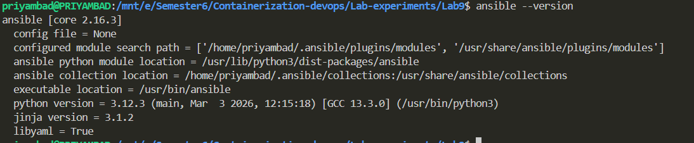
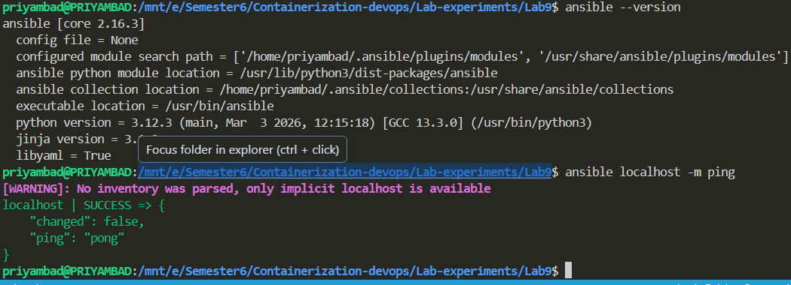
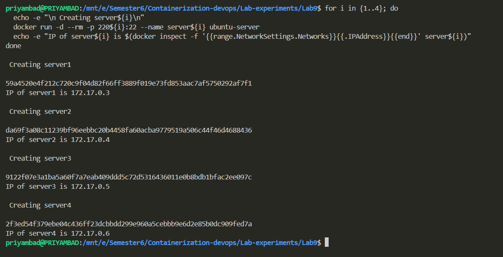
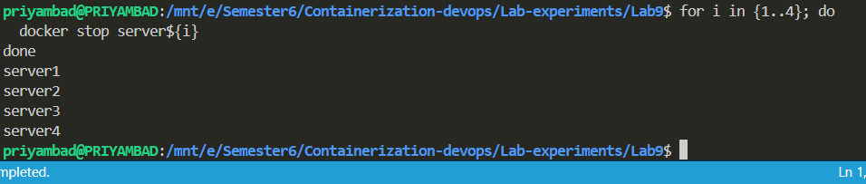
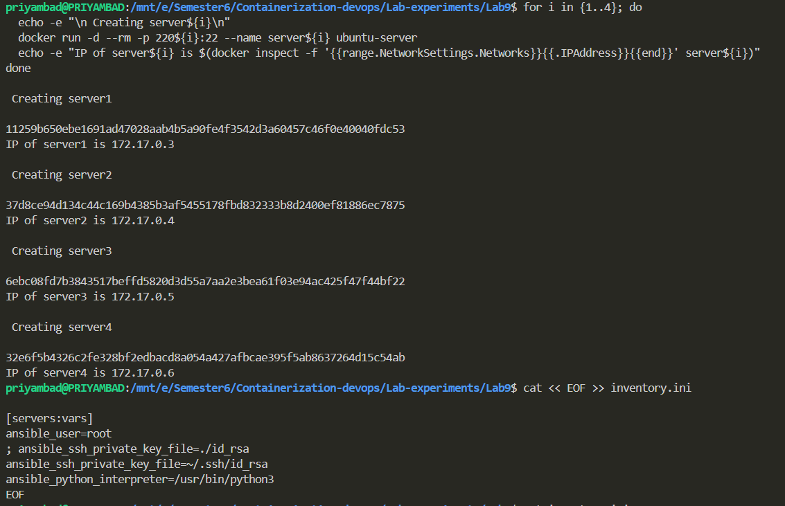
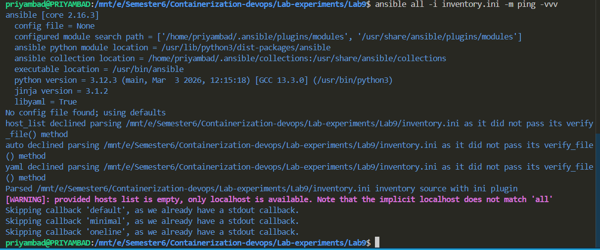

# Lab 9: Docker Container with SSH Configuration and Ansible Deployment

## Objective
To create a Docker container with SSH server capabilities and configure it using Ansible for infrastructure automation and server management.

## Tools and Technologies Used
- **Docker**: For containerization
- **Ansible**: For configuration management and automation
- **Ubuntu**: Base operating system
- **SSH**: Secure Shell for remote access
- **Python**: Scripting language

---

## Experiment Steps

### Step 1: Build the Docker Image from Dockerfile

**Description**: Create a Docker image that includes SSH server, Python 3, and SSH key authentication.

**Command**:
```bash
docker build -t ubuntu-server .
```

**Expected Output**: Image successfully built


---

### Step 2: Run the Docker Container

**Description**: Launch the Docker container with SSH port mapping and resource constraints.

**Command**:
```bash
docker run -d --rm -p 2222:22 -p 8221:8221 --name ssh-test-server ubuntu-server
```

**Parameters Explained**:
- `-d`: Run in detached mode (background)
- `--rm`: Automatically remove container when it exits
- `-p 2222:22`: Map host port 2222 to container SSH port 22
- `-p 8221:8221`: Map additional port for application services
- `--name ssh-test-server`: Container name for easy reference
- `ubuntu-server`: Image name to run

**Expected Output**: Container ID returned


---

### Step 3: Verify Container Status

**Description**: Check if the container is running and ports are properly mapped.

**Command**:
```bash
docker ps
```

**Expected Output**: Running container with port mappings visible


---

### Step 4: Test SSH Connection to Container

**Description**: Establish SSH connection to the running container using port 2222.

**Command**:
```bash
ssh -p 2222 root@localhost
```

**Expected Output**: SSH connection prompt (you may need to accept key fingerprint)
```
The authenticity of host '[localhost]:2222 ([127.0.0.1]:2222)' can't be established.
ED25519 key fingerprint is SHA256:WWmJqPAsxsn8ARhMA0J1M1e+wIqqVh262gnQ6B/Do5s.
Are you sure you want to continue connecting (yes/no/[fingerprint])? yes
```



---

### Step 5: Configure Ansible Inventory

**Description**: Set up the inventory file with container host information for Ansible to connect to.

**Inventory File Content** (`inventory.ini`):
```ini
[servers]
localhost:2222

[servers:vars]
ansible_user=root
ansible_ssh_private_key_file=~/.ssh/id_rsa
ansible_python_interpreter=/usr/bin/python3
```

**Key Configuration**:
- Define server group for organization
- Specify SSH user and private key path
- Set Python interpreter path



---

### Step 6: Run Ansible Playbook on Container

**Description**: Execute Ansible playbook to perform automated configuration tasks on the container.

**Command**:
```bash
ansible-playbook -i inventory.ini playbook1.yml
```

**Playbook Tasks** (from `playbook1.yml`):
1. Update apt package index
2. Install Python 3 (latest available)
3. Create test configuration file with server metadata
4. Execute system information commands (uname, df)
5. Display results for verification

**Expected Output**: Playbook execution report with task results


---

### Step 7: Verify Automation Results

**Description**: Check if all Ansible tasks completed successfully and verify the configuration applied.

**Verification Commands**:
```bash
# Check test file was created
ssh -p 2222 root@localhost "cat /root/test_file.txt"

# Verify Python installation
ssh -p 2222 root@localhost "python3 --version"

# Check system packages updated
ssh -p 2222 root@localhost "apt list --upgradable"
```

**Expected Output**: Confirmation that all tasks executed successfully


---

## Cleanup Commands

Stop and remove the container:
```bash
docker stop ssh-test-server
docker rm ssh-test-server
```

Remove the Docker image:
```bash
docker rmi ubuntu-server
```

---

## Key Learnings

1. **Docker SSH Configuration**: Setting up SSH in Docker requires proper key permissions (600 for private keys, 644 for public keys).
2. **Port Mapping**: Docker allows flexible port mapping for accessing services running in containers.
3. **Ansible Automation**: Ansible simplifies infrastructure management by allowing declarative configuration of multiple servers.
4. **Infrastructure as Code**: Using Ansible playbooks provides reproducible, version-controlled infrastructure setup.
5. **Security Considerations**: Using SSH key-based authentication is more secure than password-based authentication.

---

## Troubleshooting

### Issue: Permission Denied (publickey)
**Solution**: Ensure SSH public key is in `/root/.ssh/authorized_keys` with correct permissions (644).

### Issue: Connection Refused
**Solution**: Verify container is running with `docker ps` and SSH service is active inside container.

### Issue: Ansible Connection Failed
**Solution**: Check inventory.ini file paths and ensure private key file exists at specified location.

---

## Conclusion

This lab successfully demonstrates the integration of Docker containers with Ansible for automated infrastructure management. The combination allows for scalable, repeatable deployments across multiple containerized environments, making it a powerful approach for DevOps workflows.
