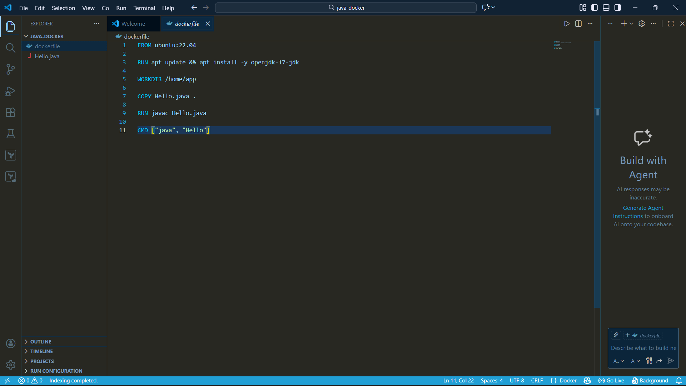
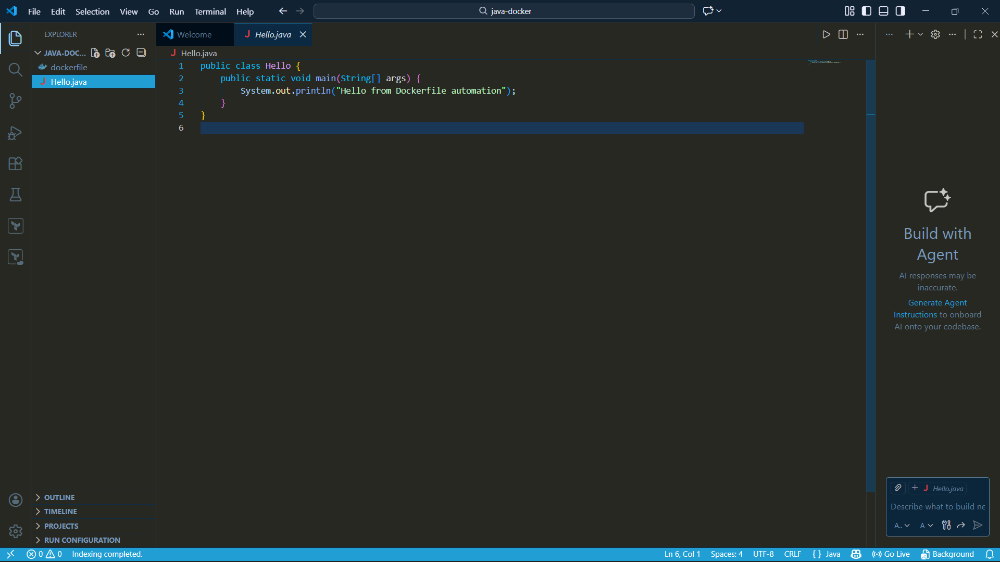
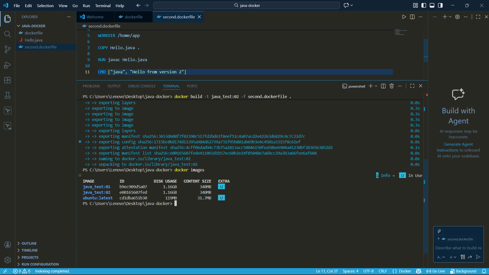
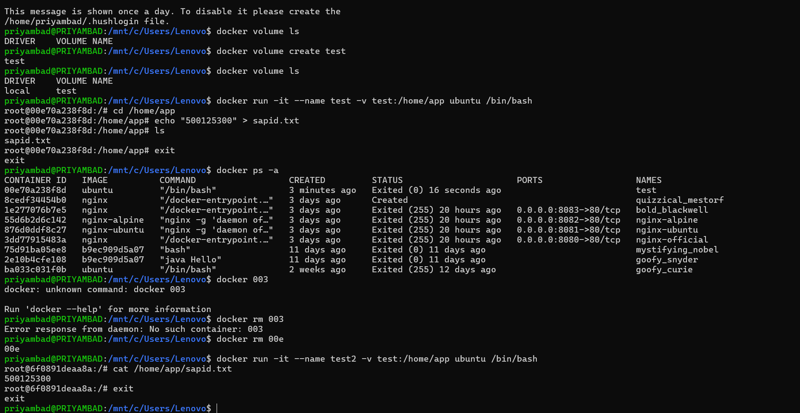

# 🐳 Docker & Containerization – Important Theory Notes

# Virtual Machines vs Containers

## Virtual Machines (VM)

Virtual Machines run on a hypervisor such as VirtualBox or VMware. Each VM includes:
- Full Guest Operating System
- Virtual Hardware
- Separate Kernel
- Application Layer

Architecture:
Host OS → Hypervisor → Guest OS → Applications

Characteristics:
- Heavyweight
- High memory usage
- Strong isolation
- Slower boot time
- Size in GBs

---

## Containers

Containers run using Docker Engine and share the host OS kernel.

Architecture:
Host OS → Docker Engine → Containers → Applications

Characteristics:
- Lightweight
- Fast startup
- Efficient resource usage
- Portable
- Size in MBs

---

## Key Differences

| Feature | Virtual Machine | Container |
|----------|----------------|-----------|
| OS | Full Guest OS | Shared Kernel |
| Boot Time | Minutes | Seconds |
| Size | Large (GBs) | Small (MBs) |
| Isolation | Strong | Process-Level |
| Performance | Slower | Faster |

---

# Docker Basic Commands

Check Docker Version:
docker --version

Pull Image:
docker pull nginx

Run Container:
docker run -d -p 8080:80 nginx

List Running Containers:
docker ps

List All Containers:
docker ps -a

List Images:
docker images

Stop Container:
docker stop <container_id>

Remove Container:
docker rm <container_id>

Remove Image:
docker rmi <image_id>

---

#  Preserving Changes Inside Containers

Containers are temporary (ephemeral). Data is lost when container is removed.

Method 1 – Commit Container:
docker commit <container_id> new_image_name

Method 2 – Create Volume:
docker volume create myvolume

Run Container with Volume:
docker run -v myvolume:/data image_name

Method 3 – Bind Mount:
docker run -v /host/path:/container/path image_name

---

# Dockerfile Important Instructions

Dockerfile is used to build custom images.

Common Instructions:

FROM        → Base image
RUN         → Execute commands
COPY        → Copy files
ADD         → Add files
WORKDIR     → Set working directory
EXPOSE      → Expose port
ENV         → Environment variable
CMD         → Default command
ENTRYPOINT  → Main container command

Build Image:
docker build -t image_name .

---

# Docker API

Docker Engine provides REST API for automation.

Check Docker API Version:
curl --unix-socket /var/run/docker.sock http://localhost/version

Used For:
- Automation
- Remote management
- CI/CD integration
- Container orchestration

---

#  Exposing Docker API

Modify daemon.json:

{
  "hosts": ["tcp://0.0.0.0:2375", "unix:///var/run/docker.sock"]
}

Restart Docker after modification.

⚠ Security Warning:
Always secure Docker API with TLS authentication when exposing externally.

---

# Core Docker Commands for Tasks

Check Logs:
docker logs <container_id>

Inspect Container:
docker inspect <container_id>

Monitor Resource Usage:
docker stats

Execute Command Inside Container:
docker exec -it <container_id> bash

Restart Container:
docker restart <container_id>

---

#  Multistage Dockerfiles (Best Practices)

Used to reduce image size and improve security.

Example Concept:

FROM node:18 AS builder
WORKDIR /app
COPY . .
RUN npm install

FROM alpine
COPY --from=builder /app /app
CMD ["node", "app.js"]

Benefits:
- Smaller final image
- Faster deployment
- Reduced vulnerabilities
- Better security

Best Practices:
- Use minimal base image (Alpine)
- Reduce layers
- Avoid installing unnecessary packages
- Use .dockerignore
- Avoid running as root
- Use multistage builds

---

#  Attach to Stopped Containers

Start Stopped Container:
docker start <container_id>

Attach to Running Container:
docker attach <container_id>

Run Interactive Shell:
docker exec -it <container_id> bash

---

# Data Management in Docker

Volume (Docker Managed Storage):
docker volume create myvolume

Run with Volume:
docker run -v myvolume:/app image_name

Bind Mount (Host Directory Mapping):
docker run -v /host/path:/container/path image_name

tmpfs (Temporary In-Memory Storage):
docker run --tmpfs /app image_name

---

#  Networking in Docker

List Networks:
docker network ls

Here it provde to ping the other container.

Create Network:
docker network create mynetwork

Connect Container to Network:
docker network connect mynetwork container_name

Default Network Types:
- bridge
- host
- none
- custom bridge

---

These are essential concepts for containerized application deployment in modern DevOps environments.

---