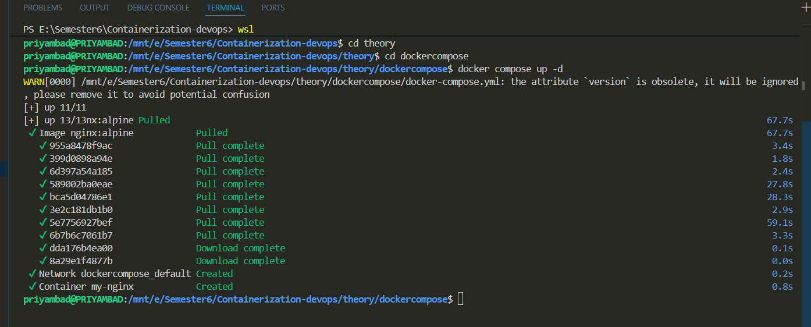
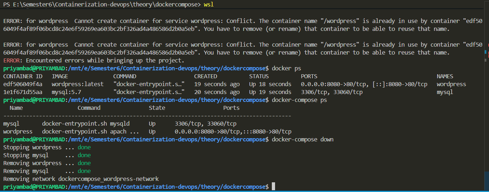
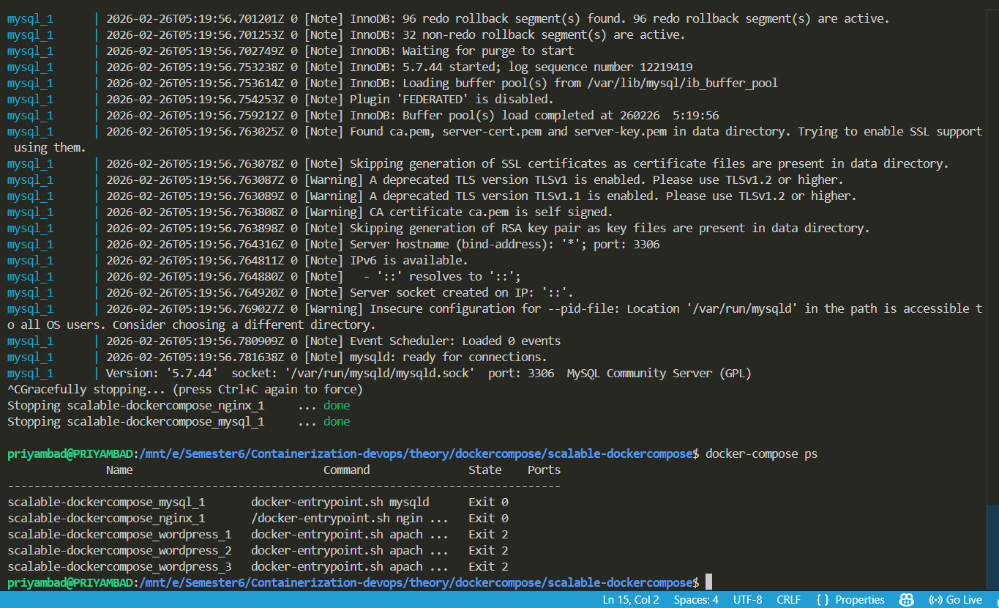

# 🐳 Docker Compose – Theory & Important Commands

## 📌 Introduction

Docker Compose is a tool used to define and manage multi-container Docker applications using a YAML configuration file called `docker-compose.yml`.

Instead of running multiple `docker run` commands, Docker Compose allows you to define all services in a single file and start them with one command.

It is mainly used for:
- Multi-container applications
- Microservices architecture
- Development and testing environments
- Managing networks and volumes automatically

---

# 📌 Why Docker Compose?

- Run multiple containers together
- Automatic network creation
- Service-to-service communication using service names
- Centralized configuration
- Easy start/stop of entire application stack
- Infrastructure as Code (IaC)

---

# 📌 Basic Structure of docker-compose.yml

```yaml
services:
  web:
    image: nginx:alpine
    container_name: my-nginx
    ports:
      - "8080:80"
    volumes:
      - myvolume:/usr/share/nginx/html
    networks:
      - mynetwork

volumes:
  myvolume:

networks:
  mynetwork:
```

---

# 📌 Important Docker Compose Commands

Start Services:
docker compose up

Start in Detached Mode:
docker compose up -d

Stop Services:
docker compose down

Stop and Remove Volumes:
docker compose down -v

View Running Services:
docker compose ps

View Logs:
docker compose logs

View Live Logs:
docker compose logs -f

Rebuild Services:
docker compose up --build

Pull Latest Images:
docker compose pull

Restart Services:
docker compose restart

---

# 📌 Key Concepts

## Services
Each container is defined as a service inside `docker-compose.yml`.

## Networks
Docker Compose automatically creates a default network.
All services can communicate using service names.

Example:
If service name is `web`, other containers can access it using:
http://web:80

## Volumes
Volumes are used for:
- Persistent storage
- Sharing data between containers
- Preventing data loss after container removal

---

# 📌 Difference Between docker run and docker compose

| docker run | docker compose |
|------------|----------------|
| Single container | Multi-container |
| Manual configuration | YAML-based configuration |
| No automatic networking | Automatic networking |
| Hard to scale | Easy scaling |
| Complex for large apps | Organized & structured |

---

# 📌 Real-World Use Case

Example stack:
- Frontend (React)
- Backend (Node.js)
- Database (MySQL)

All services can be defined in a single `docker-compose.yml` file and started using:

docker compose up -d

This simplifies deployment and environment replication.

---

# 📌 Advantages of Docker Compose

- Simplifies multi-container management
- Reduces manual configuration
- Improves development workflow
- Enables quick environment setup
- Better scalability and maintainability

---




# 📌 Methods to Scale in Docker Compose

## 1️⃣ Scaling Using --scale Flag

You can scale a service directly from the command line.

Example:
docker compose up -d --scale web=3

This command will start 3 containers of the service named `web`.

Docker automatically:
- Creates multiple container instances
- Connects them to the same network
- Assigns unique container names

Example container names:
web-1  
web-2  
web-3  

---

## 2️⃣ Scaling Using deploy.replicas (Compose File Method)

You can define replicas inside `docker-compose.yml`.

Example:

```yaml
services:
  web:
    image: nginx:alpine
    deploy:
      replicas: 3
```

⚠ Note:
The `deploy` key works properly with Docker Swarm mode.
It is not fully supported in normal docker compose standalone mode.

---

# 📌 Load Balancing in Docker Compose

When multiple replicas run:
- Docker uses internal DNS-based service discovery.
- Containers communicate using service name.
- For external load balancing, Nginx or HAProxy can be used.

Example architecture:

Client → Nginx → web-1  
                    web-2  
                    web-3  

---

# 📌 Important Commands for Scaling

Start and scale:
docker compose up -d --scale web=3

Increase replicas:
docker compose up -d --scale web=5

Check running containers:
docker compose ps

Stop services:
docker compose down

---

# 📌 Benefits of Scaling

- Improved performance
- High availability
- Better resource utilization
- Fault tolerance
- Horizontal scaling support


---

#  Conclusion

Docker Compose simplifies the deployment and management of multi-container applications by allowing services, networks, and volumes to be defined in a single YAML file. It enhances productivity, ensures consistency, and is widely used in modern DevOps and microservices environments.